<h1 align="center">
NGCBot
</h1>


<h4 align="center">
一个基于✨HOOK机制的微信机器人，支持🌱安全新闻定时推送【FreeBuf，先知，安全客，奇安信攻防社区】，👯后缀名查询，⚡备案查询，⚡手机号归属地查询，⚡WHOIS信息查询，🎉星座查询，⚡天气查询，🌱摸鱼日历⚡微步威胁情报查询，
🐛美女视频，⚡美女图片，👯帮助菜单。📫 支持积分功能，😄自定义程度丰富，小白也可轻松上手！
<div>
    <a href="http://ngc660.cn">
        
    </a>
    
    
    
</div>
</h4>

**有的人说我不要脸，dll又不是自己写的。。。在此我想说，我也没说这dll是自己写的，在特别鸣谢中也有相关关于微信hook的作者的链接。。张口就骂，这个我服🙂**

## 目录

- **1、[介绍](#1、介绍)**
- **2、[项目结构](#2、项目结构)**
- **3、[使用帮助](#3、使用帮助)**
- **4、[功能介绍](#4、功能介绍)**
- **5、[配置文件说明](#5、配置文件说明)**
- **6、[后续优化计划](#6、后续优化计划)**
- **7、[后续开发计划](#7、后续开发计划)**
- **8、[更新日志](#8、更新日志)**
- **9、[特别鸣谢](#9、特别鸣谢)**

### 1、介绍

​	NGCBot是一个基于HOOK拦截机制的微信机器人，用户高强度自定义，支持多种功能，代码逻辑清晰，因为其HOOK机制，目前仅支持Windows版本。目前支持多种功能功能调用，其功能🌱安全新闻定时推送【FreeBuf，先知，安全客，奇安信攻防社区】，👯后缀名查询，⚡备案查询，⚡手机号归属地查询，⚡WHOIS信息查询，🎉星座查询，⚡天气查询，🌱摸鱼日历⚡微步威胁情报查询，🐛美女视频，⚡美女图片，👯帮助菜单。📫 支持积分功能，😄自定义程度丰富，小白也可轻松上手！


### 2、项目结构

```
│  main.py							-- 启动主文件，启动此文件运行
│  README.MD						-- README.MD，一个介绍说明文档
│  requirements.txt					-- 该项目所需要的所有第三方库
│
├─Api_Server						-- API模块文件夹
│      Api_Server_Main.py			-- API模块文件
│
├─BotServer							-- Bot收发接收处理消息文件夹【重要！】
│      MainServer.py				-- Bot运行主服务文件	  	【重要！】
│      SendServer.py				-- Bot收发消息处理服务文件  【重要！】
│
├─Cache								-- 缓存文件文件夹
│  │  Cache_Server.py				-- 缓存文件处理服务文件
│  │				
│  ├─Fish_Cache						-- 摸鱼日记缓存文件夹
│  ├─Pic_Cache						-- 图片缓存文件夹
│  └─Video_Cache					-- 视频缓存文件夹
├─Config							-- Bot配置文件夹
│      config.yaml					-- Bot配置文件			  【重要！】
│
├─Db_Server							-- 数据库相关文件夹
│      Db_Point_Server.py			-- 积分相关数据库操作文件
│      Db_User_Server.py			-- 用户管理数据库操作文件
│
├─Output							-- 消息输出模块文件夹
│      output.py					-- 消息输出模块
│
├─Push_Server						-- 定时推送模块文件夹
│      Push_Main_Server.py			-- 定时推送操作文件
│	
├─README.assets						-- 介绍说明文档贴图文件
│      image-20221212162417977.png	-- 没啥用
│      关注.gif					   -- 没啥用
│
└─Recv_Msg_Dispose					-- 群与好友消息处理模块文件夹
        FriendMsg_dispose.py		-- 好友消息处理文件
        RoomMsg_dispose.py			-- 群消息处理文件
```


### 3、使用帮助

#### 3.1、第一次使用请看此处

**注意：此Bot只能在Windowns系统上运行！！！无法在Linux上运行安装**

首先请克隆代码到本地，使用命令如下

```shell
git clone https://github.com/ngc660sec/NGCBot.git
```

也可直接DownLoad

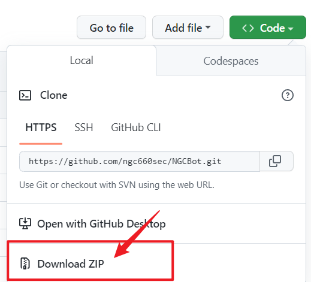

下载后解压放在本地，再下载DLL注入器以及安装相关版本微信


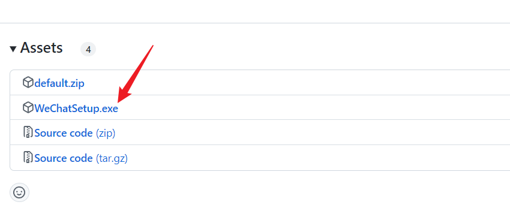

下载安装后请先打开微信，并且打开注入器进行注入

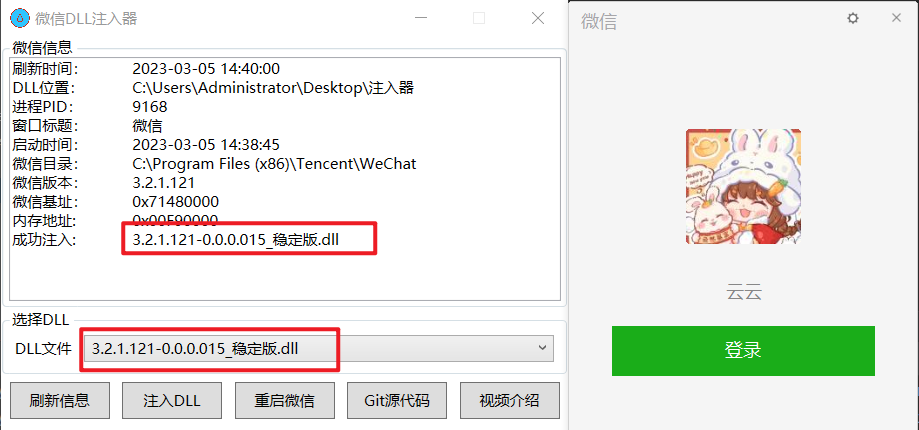

**注意：选择适合自己微信版本的DLL**

注入后，直接启动main文件即可，命令如下

```shell
python main.py
```

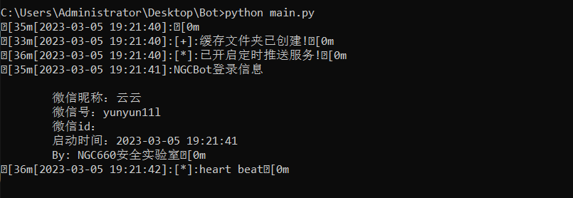

**出现此处显示，恭喜你🎉，机器人启动成功！不过不要高兴，你还需要进行下一步操作**

与机器人私聊发送一条消息并且在`Config`目录下找到`config.yaml`

找到`id2`，这是你的微信ID号，请牢记！

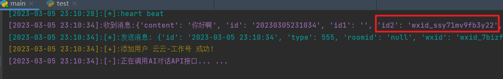

打开配置文件，将你的微信ID，填入其中！

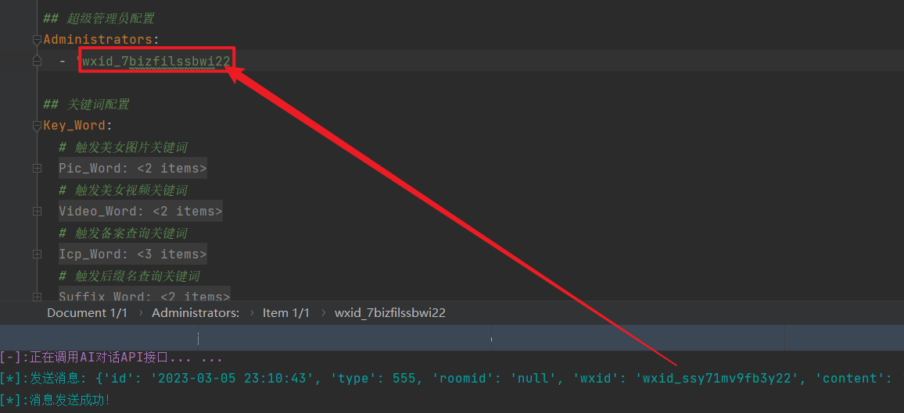

这一步是添加超级管理员，如果你想知道超级管理员有什么功能，请往下看文档。

那么问题来了，我想添加多个超级管理员怎么办？请按我下面的格式写

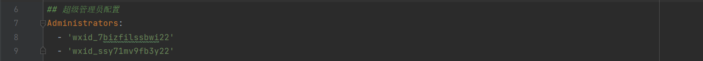

**恭喜你配置好了超级管理员，你已经可以完美使用此Bot了！恭喜🎉**

**如想要深度专研，请看下文！**


#### 3.2、相关BUG说明

##### 3.2.1、Bot的微信号必须修改，否则会报错！

##### 3.2.2、其它Bug请提交iessus，我有时间就会回复😄

##### 3.3.3、建议服务器2H4G8M，配置太低可能带不动，会卡死！！


### 4、功能介绍

#### 4.1、娱乐功能

##### 4.1.1、AI对话功能介绍

AI目前对接的是ChatGpt API接口，其AI算法强大，使用方法请看下图


**此功能可私聊使用！**使用方法请看下图

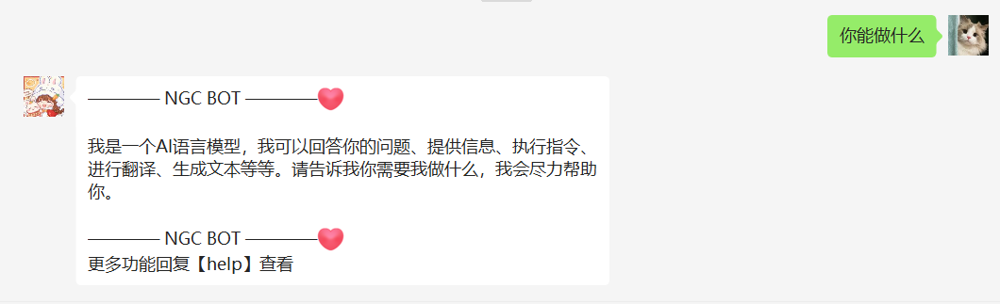

**配置AI接口**
在配置文件中配置key


如果你是境内服务器，访问不了chatgpt api 那么就需要使用代理，这里我展示我的方法
1. 安装一个clash


2. 在配置文件中设置代理ip


**其它方法请自行研究！**

##### 4.1.2、美女图片功能介绍

图片功能，可在群内发送😍涩图，使用方法请看下图

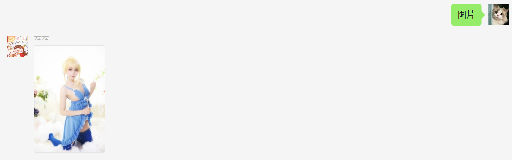

##### 4.1.3、美女视频功能介绍

美女视频功能，可在群类发送优质视频，使用方法请看下图

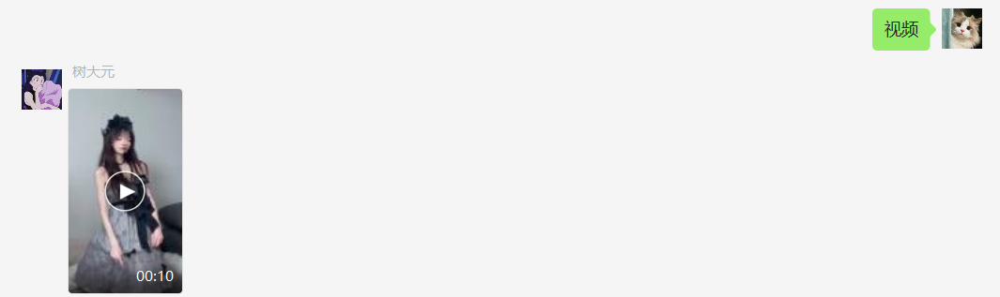

若机器人发送的是如下文件，不要慌，只是接口问题而已，此问题只会偶尔出现，不用担心！

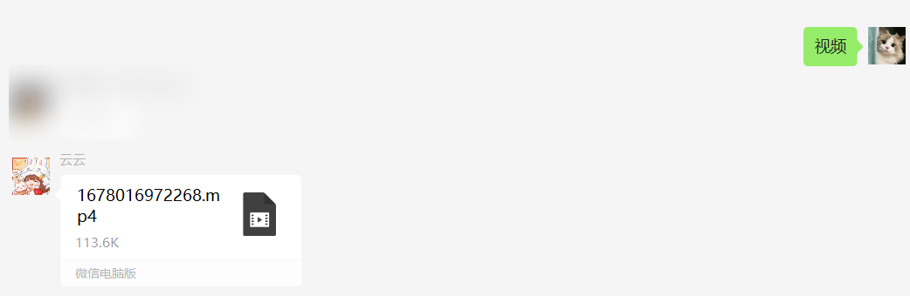

##### 4.1.4、备案查询功能介绍

此功能能查询网站备案信息，轻松获取逼站的备案主体，让社工跟进一步！使用方法请看下图


##### 4.1.5、后缀名查询功能介绍

此功能能够查询任意后缀名，让文件不再陌生！使用方法请看下图

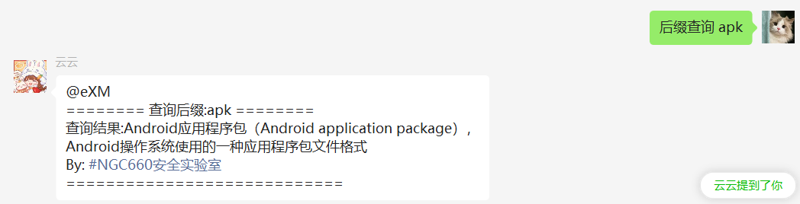

##### 4.1.6、手机号归属地查询功能介绍

此功能能够查询任意手机号归属地，让你跟女神更进一步！使用方法请看下图

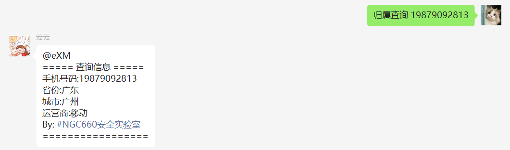

**注意：手机号是我编的，不要尝试社工我！**

##### 4.1.7、WHOIS查询功能介绍

此功能能够查询任意域名WHOIS信息，让你跟麻花腾跟进一步！使用方法请看下图

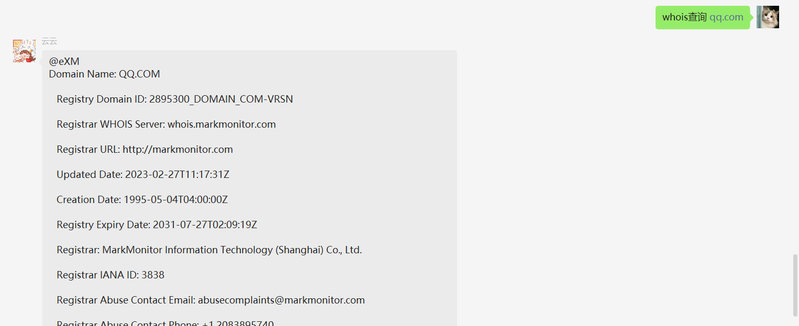

##### 4.1.8、摸鱼日历功能介绍

此功能能够推送摸鱼日历，让您一天轻松摸鱼，把控摸鱼时长，打倒资本家！让资本家无话可说！使用方法请看下图

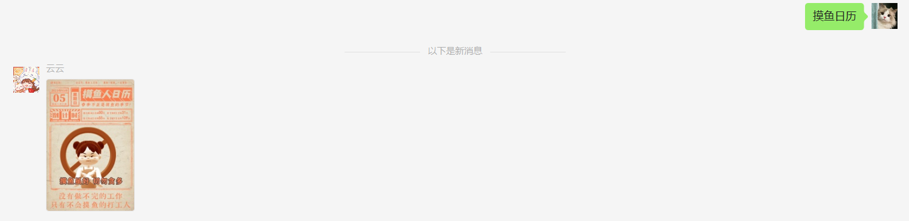

**注意：此功能已开启定时推送，在工作日可定时推送，默认推送时间为10：00，可在配置文件中修改。如要修改配置文件，请看[配置文件说明](#5、配置文件说明)**

##### 3.1.10、天气查询功能介绍

平平无奇的天气查询，轻松在群类掌握你本地的天气，让你约会更轻松！使用方法请看下图

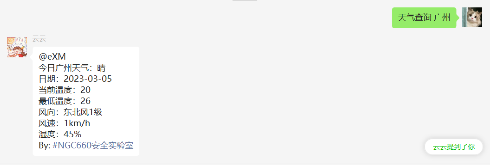

##### 3.1.11、舔狗日记功能介绍

舔狗的日常是怎样的？如何当一个舔狗？怎么去当舔狗？此功能让你专心学做当舔狗，让舔狗不再稀缺！使用方法请看下图

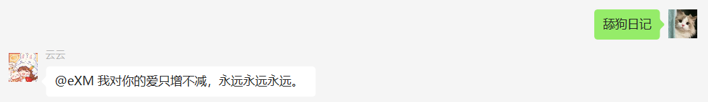

##### 3.1.12、星座查询功能介绍

想知道你的星座运势？想明白今天该不该做什么？要知道今天适合干什么？此功能让你轻松把控星座运势，人生大事！使用方法请看下图

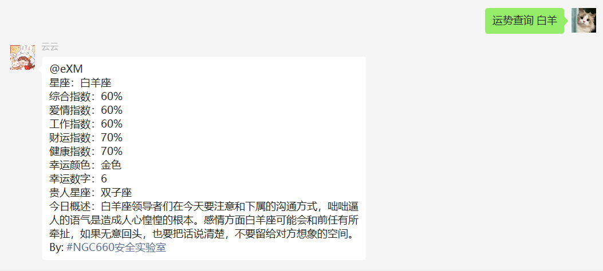

##### 3.1.13、早安寄语功能介绍

一个人太孤单？早起没人说早安？想要每天的早安问候？此功能满足你的欲望！使用方法请看下图

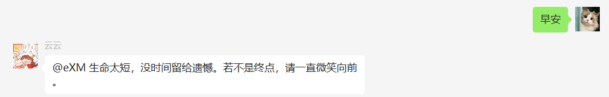

#### 4.2、积分功能

##### 4.2.1、微步威胁IP情报查询功能

你叫王大锤，是一个公司的唯一一个混子蓝队成员，某天你单位的服务器被黑客攻击了，还好公司的大牛迅速响应，实现毫秒级IP封锁，此时大佬交给你一个任务。

大佬：”大锤，你看看这个IP，是个跳板机还是黑客用的VPS“

你：”好，我看看...“

此时的你心中忐忑不安，因为你只是一个混子蓝队，VPS是什么，跳板机又是个什么，有什么用，你怎么会知道。于是你只能在群里求助各方大佬，突然某群的一位群友引起了你的注意，内容如下

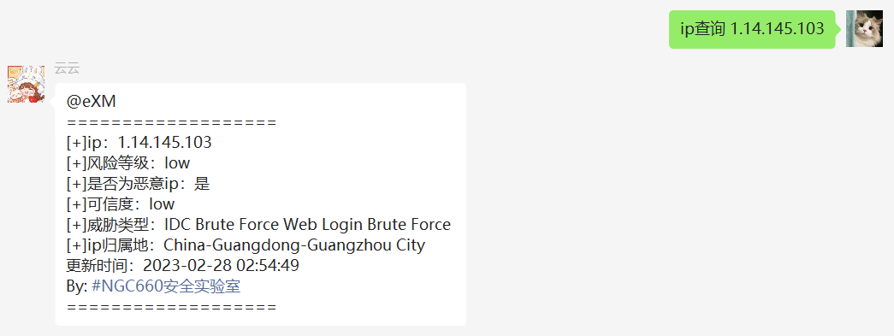

你敏锐的注意到了其中一点 —> ""是否为恶意IP：是"，此时你更加确定了这台不是跳板机！此时大佬又交给了你一个任务，让你看看另一个IP，于是你也参考群友的格式来发送，但是却出现了下面的结果

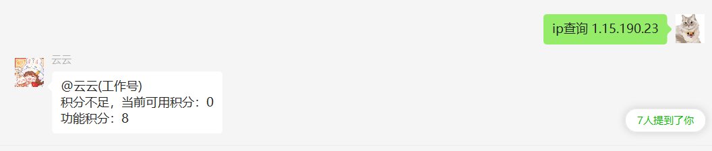

没有积分！怎么办！百度有用吗！我会百度吗！怎么搞积分！联系群主！对！联系群主，于是你赶紧联系了群主，让群主给你加积分，但是


群主说了一句非常恐怖的话！

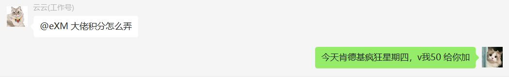

于是你只能含泪给群主转了50，让群主给你加了50积分，害，都怪自己没技术，你这样责备自己。我以后一定要好好学习，多多努力。做一名NGC660安全实验室的正式成员！

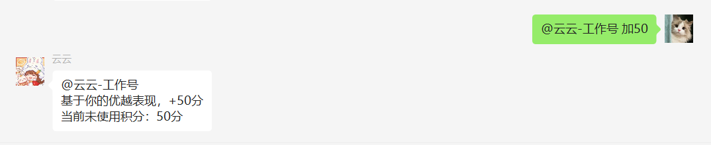

拥有了积分于是你又开始快乐的给大佬提交情报，又开始了新一天的混子生活。。。

编不下去了，目前只有这一个积分功能，其它想要加的可以提交iessus，或者自己添加即可！

##### 4.2.2、签到功能

作为一名合格的超管，总不能让群员V你50才给他积分吧，所以请看签到功能

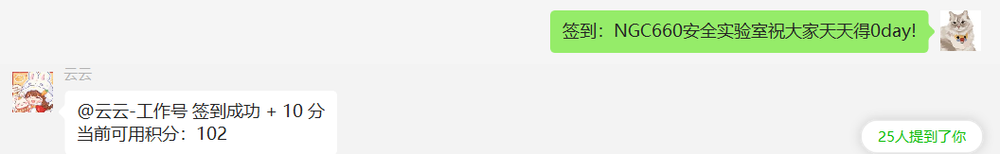

但是总不能一天签到多次吧，群友嫖我积分怎么办？

**放心，本作者有练习时长两年半的开发经验，一天只能签到一次，每日00.00清空签到表，请诸位放心🙂**

##### 4.2.3、积分查询功能

什么？你居然忘记了你有多少积分？这还能忍，直接让管理员给你清零好不好！还好我贴心，给你们安排了这个功能

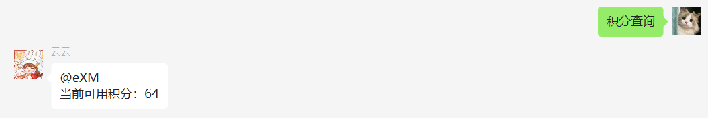

**注意：虽然管理员使用积分功能免费，但是管理和超管还是有积分的**

##### 4.2.4、赠送积分功能

普通群友使用此功能，可赠送对方积分🙂，管理员就可以不用，直接增加积分即可

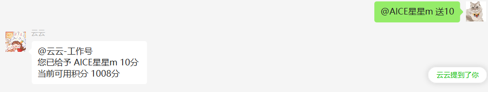

#### 4.3、定时推送功能

**注意：定时推送功能只有管理员或者超管开启才能使用**

##### 4.3.1、开启推送服务

作为一名合格的管理员，当然要学会如何去开启推送服务，下面我来教你

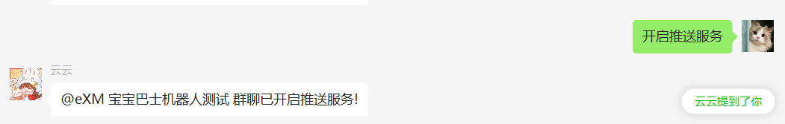

##### 4.3.2、关闭推送服务

作为一名拥有高情商的管理员，当然要去学会如何关闭推送服务，下面我来教你

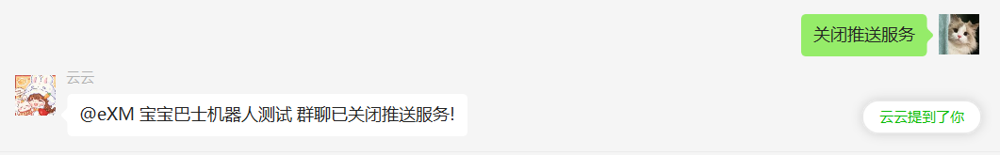

**什么？！你居然忘记了这个群有没有开服务？你真不是一个合格的管理员，还好有我在🙂**

##### 4.3.3、查看推送服务

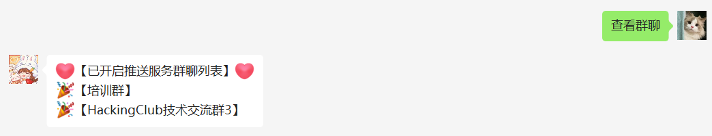

**你都知道有推送服务了，推送服务能推送啥你不会不知道把！不会吧不会吧！**

##### 4.3.4、推送服务介绍

推送服务，可在**工作日**定时推送**早报，晚报，摸鱼日历，下班提醒**。仅仅如此，如果你想定时推送比较哇塞的涩图，其实也不是不可以🙂

#### 4.4、超级管理员功能

**首先需要知道在本bot中，一共有三个权限，每个权限的功能都是不一样的，接下来我会逐一讲解每个权限的独有的功能，至于那些普通的通用的功能，基本上群友能用，管理、超管、都能用**

##### 4.4.1、添加管理员

想要管理群聊更加轻松？让小弟帮你管理，输入这条命令让你的小弟变成管理员！

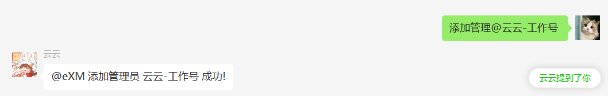

##### 4.4.2、删除管理

什么？你的小弟叛变了？！看来他这管理员的特权是不想要了，让我们把小弟的管理权限给踢掉！

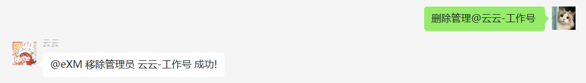

**不同地方的小弟，只能负责他们所对应的区域。说人话就是【每个群的管理是不通用的】**

什么？！你不知道你小弟有没有管理权限？！那不好意思，本作者没有写查看管理的功能，不过当你再次添加的时候，会有如下变化

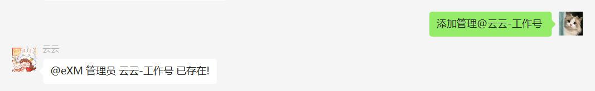

##### 4.4.3、机器人消息转发

**前女友给Bot发消息要复合你不知道？没有关系，有了这个功能再也不怕前女友给Bot发的消息收不到了！**

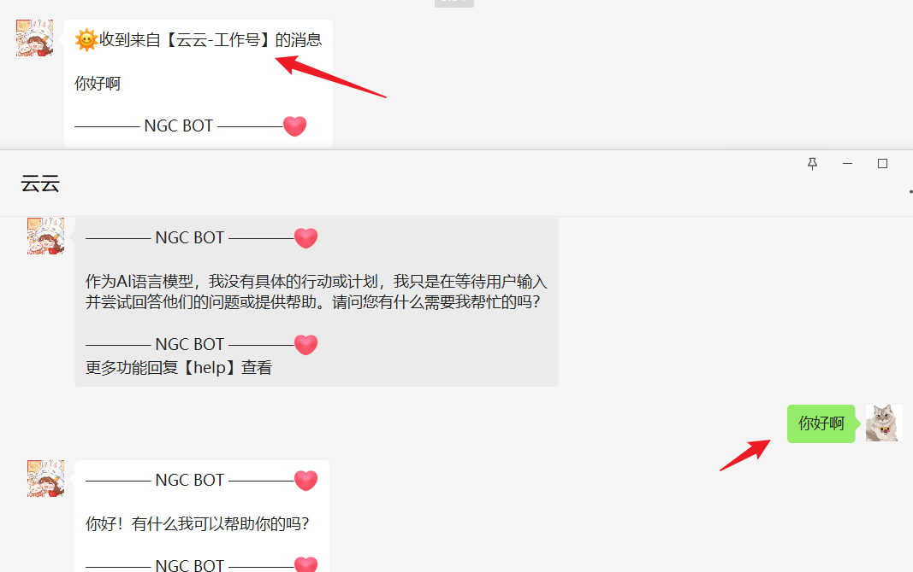

**注意：如果发起会话的是超级管理员，那么消息将不会转发，转发消息的接收者为超级管理员**

##### 4.4.4、消息转发给好友

什么？你没有加你前女友，那你前女友怎么会有你Bot的微信？没关系，我也是经历过的人，我都懂，所以我贴心的撰写了消息转发给好友的功能

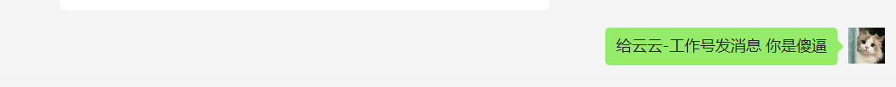


你说你女朋友是个非主流，喜欢用杀马特文？那不好意思，可能你的消息转发不了给你女朋友了！

**注意：在最新的测试中，有些颜表情当名字的也可以转发，不过请复制对方名字！**

##### 4.4.5、清除缓存功能

当你的群友调用了很多图片或者视频或者摸鱼日历功能，就会产生许多缓存，此时可以输入此条命令，会将缓存清空

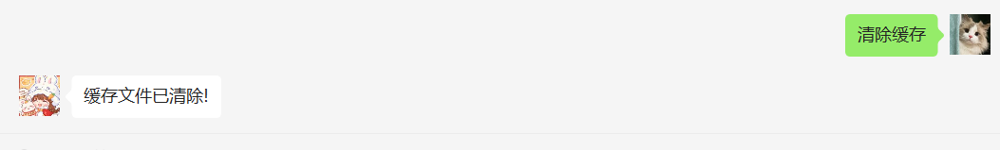


#### 4.5、管理员功能

##### 4.5.1、管理员功能介绍

作为一名合格的小弟，一定要知道管理员到底有个啥用，这样才能更好的帮助老大去进行管理，管理好了，步步高升。管理不好，可能小命不保🙂

作为一个合格的管理员，你掌握的功能有这么一些：

​	1、早报推送【手动早报推送】

​	2、晚报推送【手动晚报推送】

​	3、开启推送服务

​	4、关闭推送服务

​	5、拉黑群聊

​	6、解除拉黑

​	7、用户积分操作

但是你知道这些有啥用吗，别担心，听我慢慢讲述，故事还长，洗耳恭听！

##### 4.5.2、早报推送

**注意：早报可以定时推送，也可以手动推送！**

平平无奇的功能，无非就是爬虫了，我没有要讲述的亮点，而且也编不下去了，直接上图！

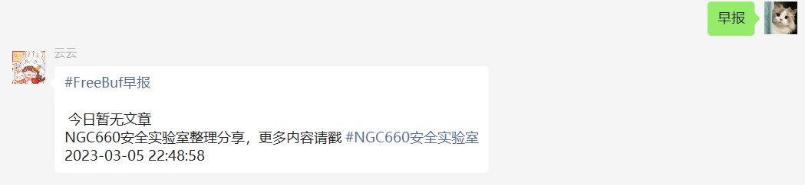

今天看来没有文章啊，可惜可惜🙂

##### 4.5.3、晚报推送

其实一样的，不过你是不是好奇怎么触发的，在下面[配置文件说明](#配置文件说明)一章中我们会讲到

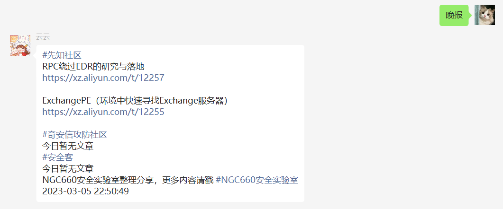

看来晚报文章不少啊，爬取的一些社区相信你们也是知道的，我就不介绍了，手都敲麻了...

##### 4.5.4、开启推送服务

我讲过，没看到请[自行跳转](#4.3、定时推送功能)

##### 4.5.5、关闭推送服务

我也讲过，没看到也[自行跳转](#4.3.2、关闭推送服务)去

##### 4.5.6、拉黑群聊功能

遇到傻逼天天发送图片、视频，消耗你服务器资源？这种人最可恨了，玛德！所以我在这里提供了拉黑群聊功能，让此群聊不能使用**娱乐功能**

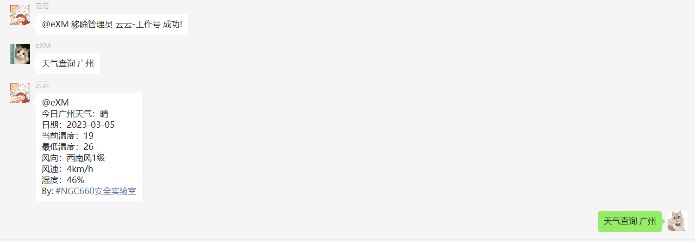

**注意：即使拉黑了群聊，管理员以及超管仍然能够使用娱乐功能！**

##### 4.5.7 、解除拉黑功能

啊？群主把傻逼踢了？求你解除拉黑？因为他要V你50？OK！马上解除！

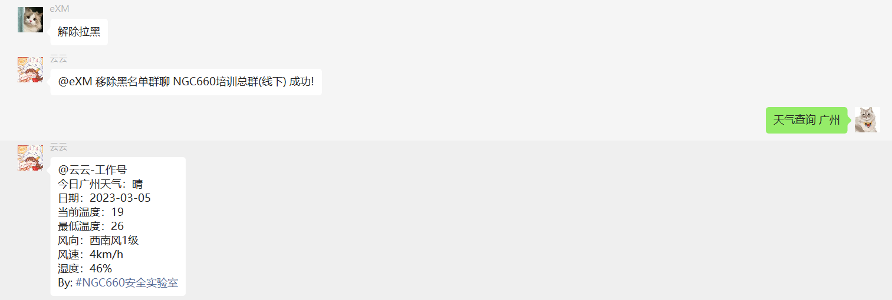

##### 4.5.8、用户积分操作

既然你是小弟了，肯定是会收点保护费的，既然收了，那不得给人家加积分啊，什么？你不知道加积分？

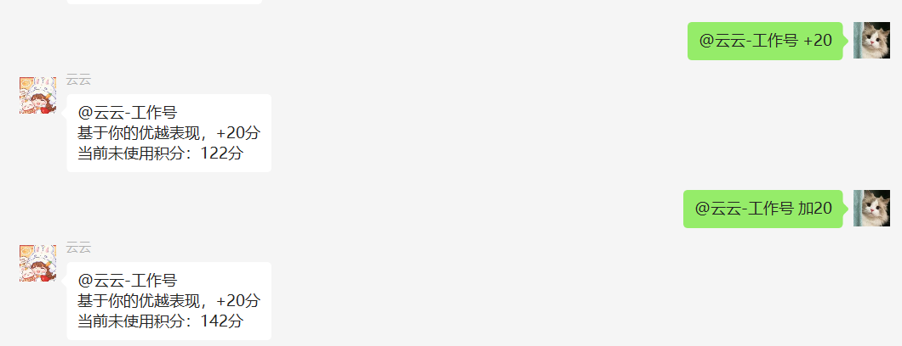

什么？他骂你大傻逼？

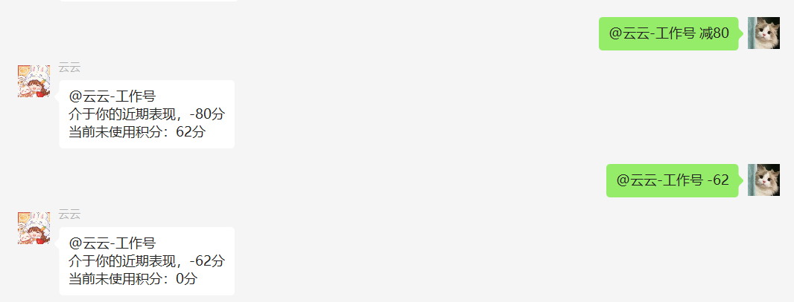

#### 4.6、普通群友功能

**作为一名遵纪守法的好公民，当然是要正常使用Bot的相关功能，所以普通群友没有什么奇奇怪怪的操作，你不会用的话，请回复help，超级Bot就会马上帮助你！**

##### 4.6、帮助功能

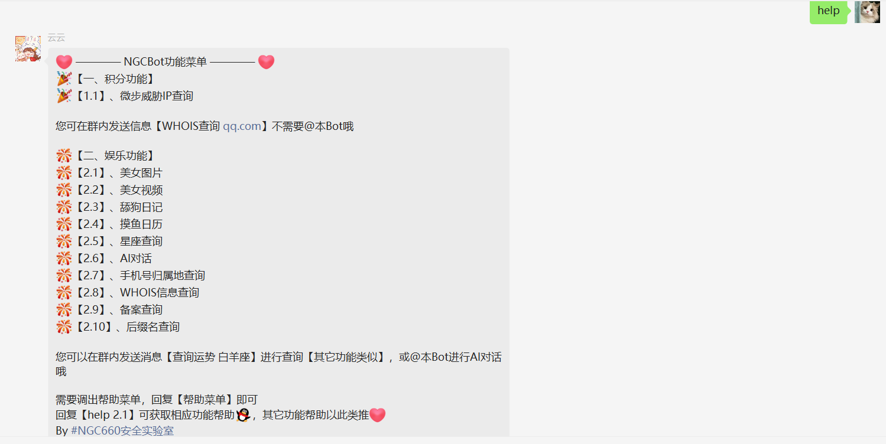

什么？看不懂功能怎么用？本作者自有办法！

回复help+相应编号即可!

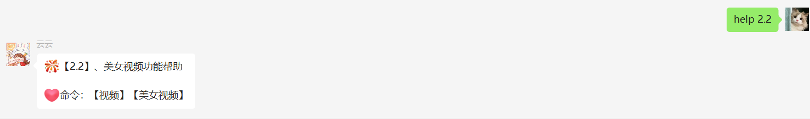

**注意：私聊无法获取帮助信息，必须在群内发送HELP！**


### 5、配置文件说明

##### 5.1、机器人服务配置

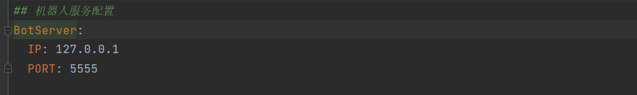

此处别乱来，改了就GG

##### 5.2、超级管理员配置

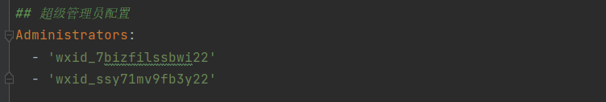

添加超级管理员的地方，如果不会，[从头](#1、介绍)开始看文档！

##### 5.3、关键词配置

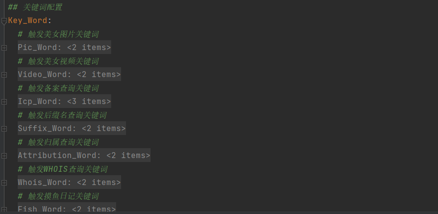

这个比较多，都是相应功能触发的关键词，比如说美女图片，如果你再多添加一个关键词，就可以换个关键词触发！来试试

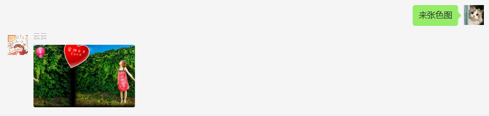

**注意：修改配置文件后需要重启Bot**

其它的类似，相信自己！一定能调教好此Bot！

##### 5.4、API接口服务配置

此处只需要获取相应的KEY

打开此[网址](https://www.tianapi.com/source/e81d05c8b1)

注册登录后，获取你的appid、key、appsecret

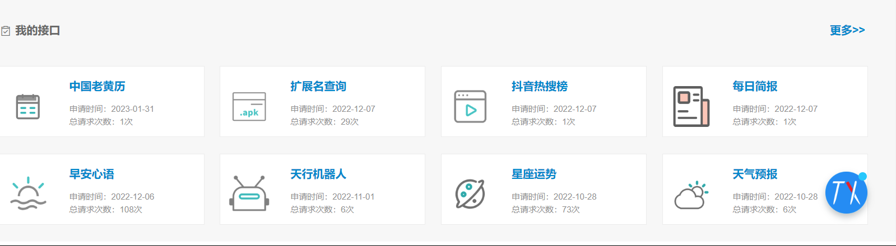

你要用什么功能，就开通什么接口，不过目前只接入了配置文件中的接口，相关接口请查看配置文件此处**【注意，此处展示的天气查询接口是旧版接口，如果你想使用这个旧版接口，那就不需要开启天气预报接口服务，直接打开如下网址】**

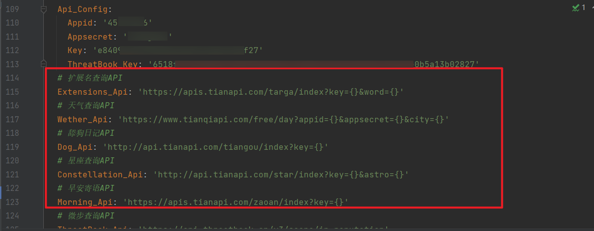

开通这些接口即可

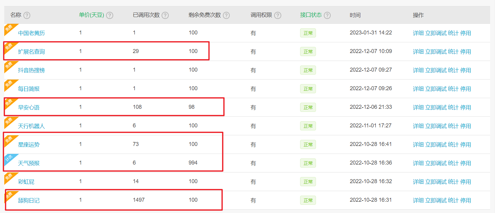

在此处搜索接口名称开通

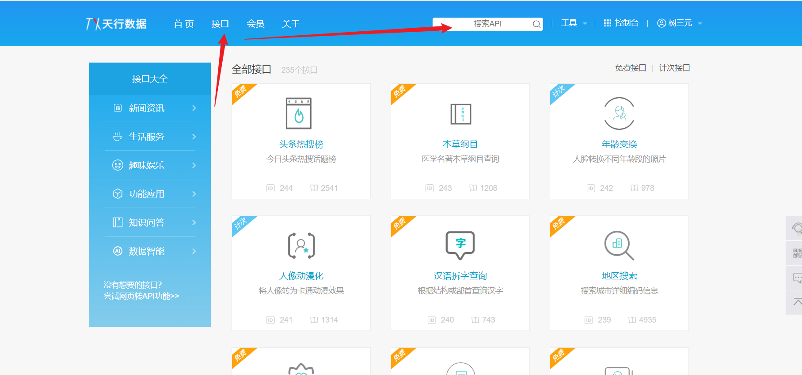

开通后你会获得一些配置，在此处查看

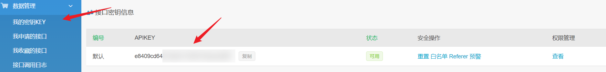

这是你的Key，复制，粘贴到配置文件中

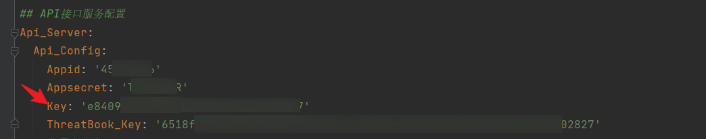

**Appid与Appsecret，这两个是用于旧版天气查询接口，因为这个接口是免费的，所以采用了此API接口，如果你不想用，请自行修改天气查询的相关调用代码，如果你仍用旧版天气查询接口，请看此处**

打开此[网站](https://www.tianqiapi.com/)

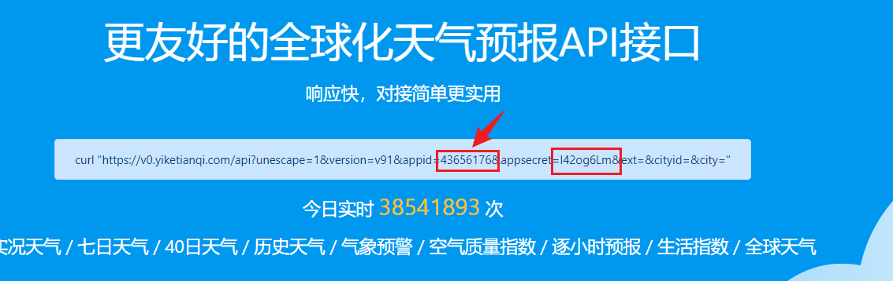

在此处将两个相关参数放到配置文件中即可！

**微步Key：**这玩意自己去申请，我相信你混子蓝队的水准是能够自己申请的，申请key之后放入配置文件中即可


**图片API和视频API：**这两玩意别乱改，调用的话是随机调用的，不会出现一直调用同一个接口的情况

##### 5.5、积分功能配置

很简单的配置，一张图概述

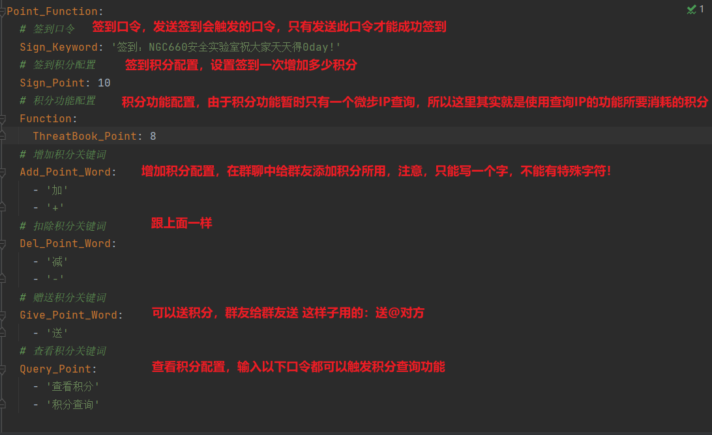

赠送积分说明请[点击此处](#4.2.4、赠送积分功能)

##### 5.6、定时推送配置

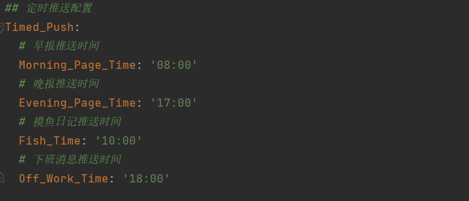

**注意：如果是在早上8点，请输入`08:00`！注意格式！**

##### 5.7、系统相关配置

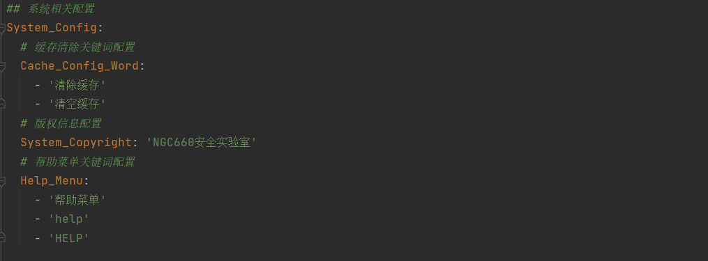

版权信息处，为使用各个功能时结尾处的信息

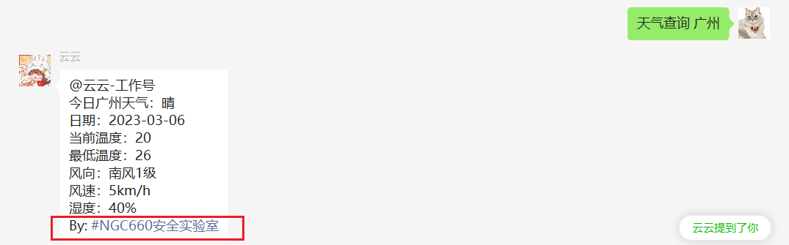

其它的就不介绍了


### 6、后续优化计划	

```shell
1. 优化群消息处理【已优化】
2. 优化相关配置信息【已优化】
3. 优化积分模块【已优化，可@多人加积分】
4. 优化好友消息处理【已优化】
5. 优化总体架构
6. 好友消息转发【已优化】
```


### 7、后续开发计划

```
- Github工具 + CVE 实时推送【连接不上外国站，已阉割】
- MD5解密【暂时没钱】
- 开发Web端管理系统
- ... ...
```


### 8、更新日志

```
- 【2022.12.8】 推送Bot 1.0版本，为初始版本
- 【2022.12.17】推送Bot 1.2版本，新增部分接口，重写部分代码，新增积分功能
- 【2023.1.1】  推送Bot 1.3版本，重写部分代码，优化代码逻辑，优化积分功能，优化定时推送功能
- 【2023.3.6】  推送Bot 1.4版本，总体代码优化，优化定时推送，优化积分功能，新增消息转发，维护API服务调用
```

#### 最后，若在使用过程中有任何问题，也提交Iessus，或者关注微信公众号，后台回复消息


### 9、特别鸣谢

- https://github.com/cixingguangming55555/wechat-bot

- https://github.com/zhizhuoshuma/WechatBot
- https://github.com/tom-snow/wechat-windows-versions
