<h1 align="center">
NGCBot
</h1>


<h4 align="center">
一个基于✨HOOK机制的微信机器人，支持🌱安全新闻定时推送【FreeBuf，先知，安全客，奇安信攻防社区】，👯后缀名查询，⚡备案查询，⚡手机号归属地查询，⚡WHOIS信息查询，🎉星座查询，⚡天气查询，🌱摸鱼日历⚡微步威胁情报查询，
🐛美女视频，⚡美女图片，👯帮助菜单。📫 支持积分功能，😄自定义程度丰富，小白也可轻松上手！
<div>
    <a href="http://ngc660.cn">
        
    </a>
    
    
    
</div>
</h4>

## 目录


### 介绍

​	NGCBot是一个基于HOOK拦截机制的微信机器人，用户高强度自定义，支持多种功能，代码逻辑清晰，因为其HOOK机制，目前仅支持Windows版本。目前支持多种功能功能调用，小白也能轻松搭建！👯

### 项目结构

```shell
  _   _  ____  ____ ____        _   
 | \ | |/ ___|/ ___| __ )  ___ | |_ 
 |  \| | |  _| |   |  _ \ / _ \| __|
 | |\  | |_| | |___| |_) | (_) | |_ 
 |_| \_|\____|\____|____/ \___/ \__|
                                    
│  main.py				---主服务
│  README.MD			---README文件
│  requirements.txt		---依赖库
│  test.py				---测试专用文件
│
├─BotServer				--- 机器人服务
│  │  MainServer.py		--- 机器人主服务
│  │  SendServer.py		--- 发送消息服务
│  │  __init__.py
│  │
│  └─__pycache__
│          MainServer.cpython-38.pyc
│          SendServer.cpython-38.pyc
│          __init__.cpython-38.pyc
│
├─config				--- 配置文件夹
│      config.yaml
│      points.db		--- 积分数据库
│      privilege.db		--- 管理数据库
│
├─DailyPush				--- 定时推送文件夹
│  │  Daily_push_server.py			--- 定时推送服务
│  │  Push_main_server.py			--- 定时推送主服务
│  │  __init__.py
│  │
│  └─__pycache__
│          Daily_push_server.cpython-38.pyc
│          Push_main_server.cpython-38.pyc
│          __init__.cpython-38.pyc
│
├─Db_server				--- 数据库服务文件夹
│  │  Db_points_server.py			--- 积分数据库服务
│  │  Db_user_server.py				--- 管理数据库服务
│  │
│  └─__pycache__
│          Db_points_server.cpython-38.pyc
│          Db_user_server.cpython-38.pyc
│
├─File
│  │  File_server.py				--- 文件操作服务
│  │
│  ├─girl_pic						--- 美女图片存放目录
│  ├─girl_video						--- 美女视频存放目录
│  ├─touch_fish						--- 摸鱼日历存放目录
│  └─__pycache__
│          File_server.cpython-38.pyc
│
├─Get_api
│  │  Api_news_server.py			--- 新闻获取服务
│  │  Api_server.py					--- 其它API调用服务
│  │  __init__.py
│  │
│  └─__pycache__
│          Api_news_server.cpython-38.pyc
│          Api_server.cpython-38.pyc
│          __init__.cpython-38.pyc
│
├─Output							--- 信息输出文件夹
│  │  output.py
│  │  __init__.py
│  │
│  └─__pycache__					
│          output.cpython-38.pyc
│          __init__.cpython-38.pyc
│
├─README.assets
│      image-20221212162417977.png
│
├─recv_msg_dispose					--- 接收消息处理服务
│  │  FriendMsg_dispose.py			--- 通讯录好友消息服务
│  │  RoomMsg_dispose.py			--- 群消息服务
│  │  __init__.py
│  │
│  └─__pycache__
│          FriendMsg_dispose.cpython-38.pyc
│          RoomMsg_dispose.cpython-38.pyc
│          __init__.cpython-38.pyc
│
└─注入器			--- 注入器
        3.2.1.121-0.0.0.015_稳定版.dll
        3.2.1.121-0.0.0.018.dll
        3.3.0.115-0.0.0.001.dll
        3.6.0.18-0.0.0.004.dll
        readme.md
        version2.8.0.121-3.5.7.66.dll
        version2.9.0.123-4.5.7.73.dll
        version3.1.0.66-0.0.0.13.dll
        微信DLL注入器V1.0.3.exe
```

### 如何使用

​	首先你需要一台Windows主机，并且安装`Python3.8`或者以上版本，接下来请安装依赖库

```python
pip install -r requirements.txt
```

安装完毕之后之后，需要下载`3.2.1.121`版本的微信，在[Releases](https://github.com/ngc660sec/NGCBot/releases/tag/v1.0)里面有提供的版本。登陆微信之后，在项目文件中打开`注入器`文件夹，进行注入

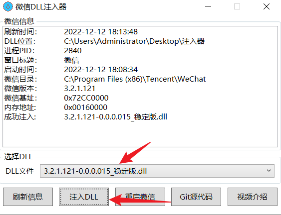

注入完毕之后，可以启动`main.py`文件

```python
python main.py
```

若无报错，恭喜🎉，你已经搭建完成！

### 功能介绍

```shell
1. 超级管理员功能
	- 所有功能
2. 普通管理员功能
	- 添加特权群聊
	- 删除特权群聊
	- 添加黑名单群聊
	- 删除黑名单群聊
	- 添加积分
	- 扣除积分
3. 普通群聊功能
	- 娱乐功能
	- 积分功能
	- 自定义回复功能
4. 特权群聊功能
	- 定时推送功能
	- 新人入群提醒
	- 普通群聊功能
5. 黑名单群聊功能
	- 积分功能
	- 自定义回复功能
--------------------------------------------------------------------------------------------------------
积分功能:
	- 手机号归属地查询
	- WHOIS查询
	- 备案查询
	- 后缀名查询
	- 微步情报查询
	- 签到
	- 积分查询
娱乐功能:
	- AI对话
	- 美女视频
	- 美女图片
	- 舔狗日记
	- 摸鱼日历
	- 早安寄语
	- 星座运势查询
	- 天气查询
```

### 配置文件说明

配置文件在`config`文件夹中，`config.yaml`就是配置文件，打开配置文件，我们需要做以下操作，来保证服务能够正常使用

1. 配置超级管理员【可配置多个超管用户】

   - 运行Bot之后，随便给机器人发一条消息，来获取您的`wxid`

     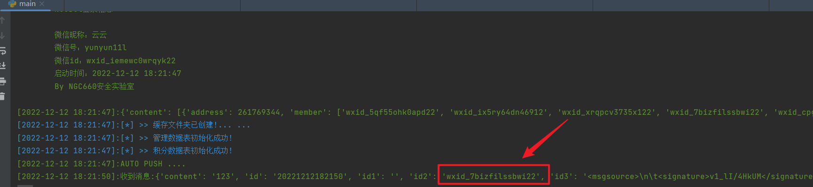

   - 随后在配置文件中添加即可

     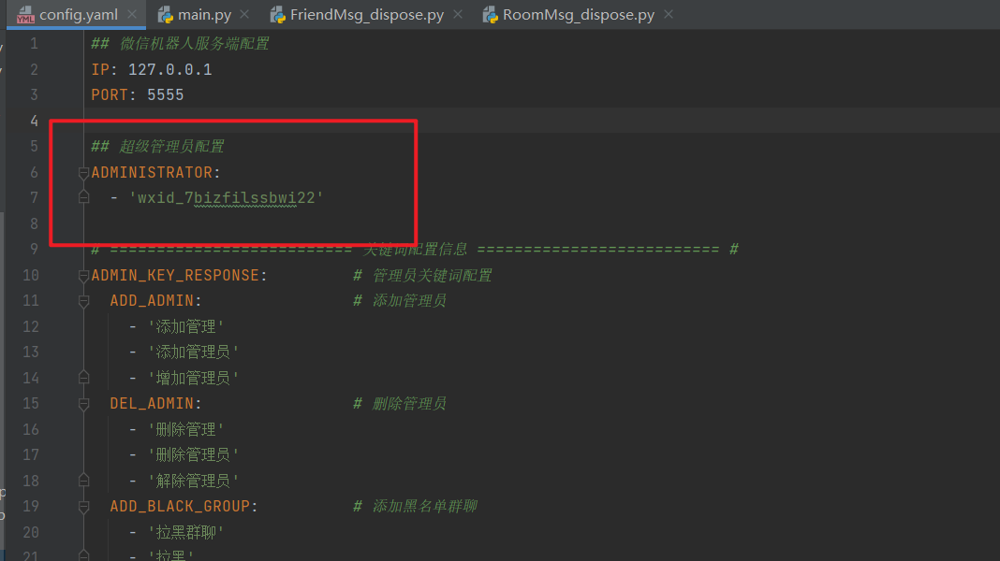

   - 若要添加多个超管，请这样操作

     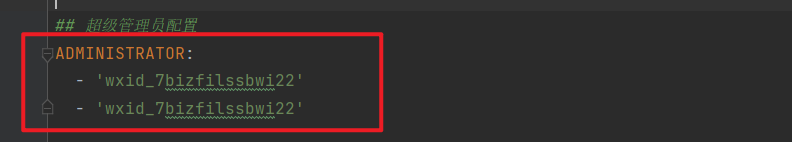

2. 配置您的API服务

   - 配置天行API服务，请在[天行数据](https://www.tianapi.com/)中获取自己的相关配置

     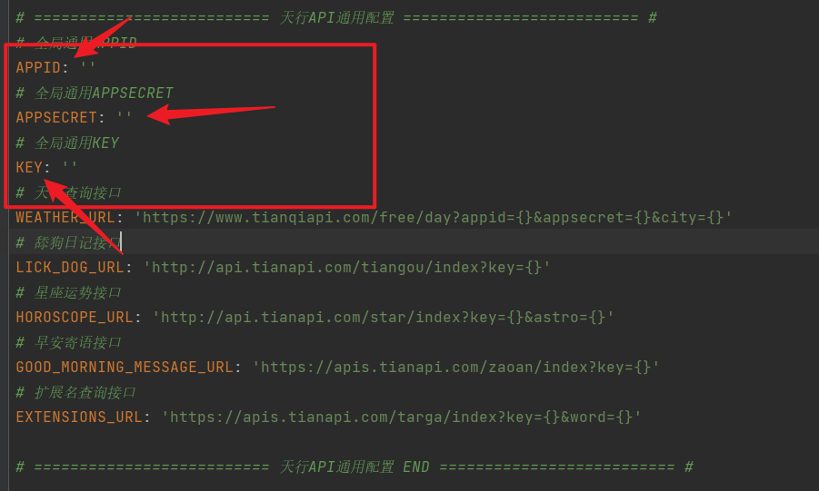

   - 配置微步KEY，请在[微步社区](https://x.threatbook.com/)获取您自己的KEY

     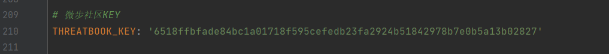

3. 管理员配置说明

   管理员一共分为两种，一种是超级管理员，一种是普通管理员，超级管理员拥有添加管理，删除管理功能，管理员能够不用积分去使用积分功能，并且能够添加特权群聊，拉黑群聊的功能【超级管理员也有】

   添加管理员需要使用关键词@要添加的群友，例如`添加管理@云山`，当然，关键词可以自己配置

   - 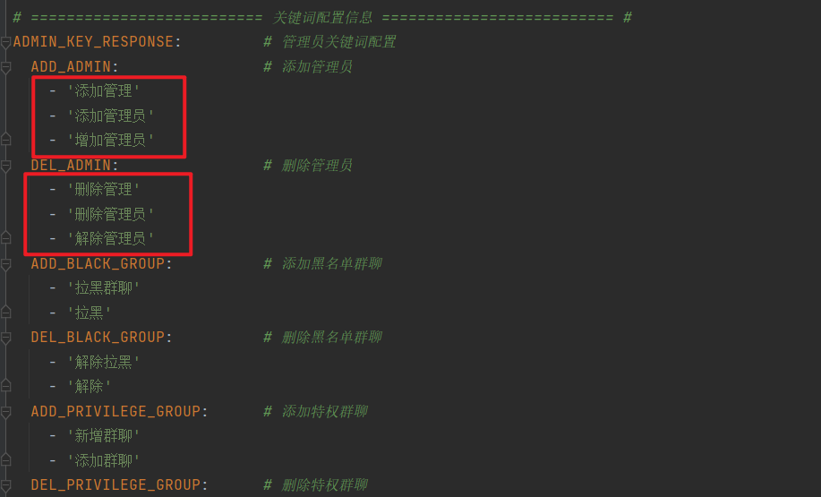

   - 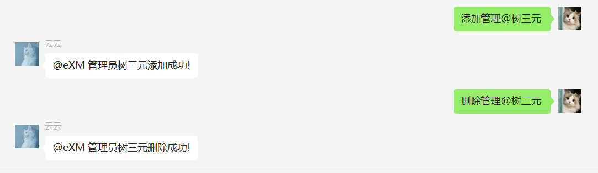

其它功能也是一样的，只不过不需要`@群友即可`

- 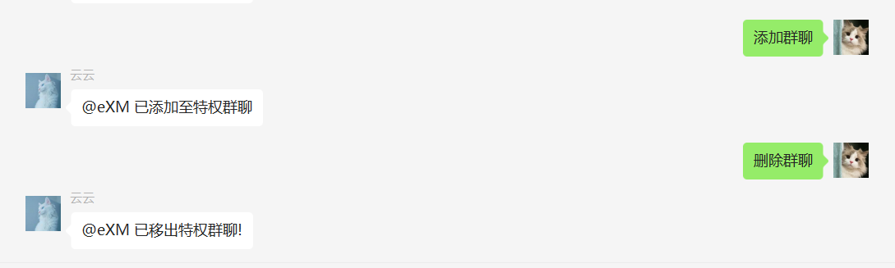

- 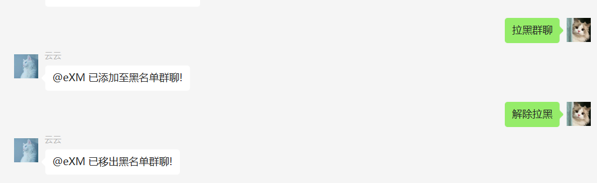

4. 关键词回复配置
   - 如只有一个关键词配置，说明此功能只需要一个关键词即可触发
     - 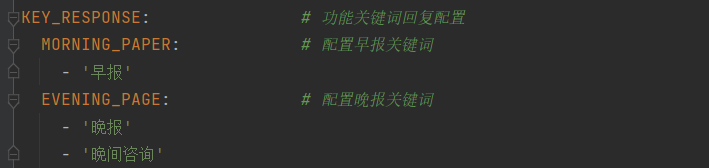
     - 
     - 如没有内容，说明今日没有文章
   - 如有两个关键词配置，说明此功能需要两个关键词触发
     - 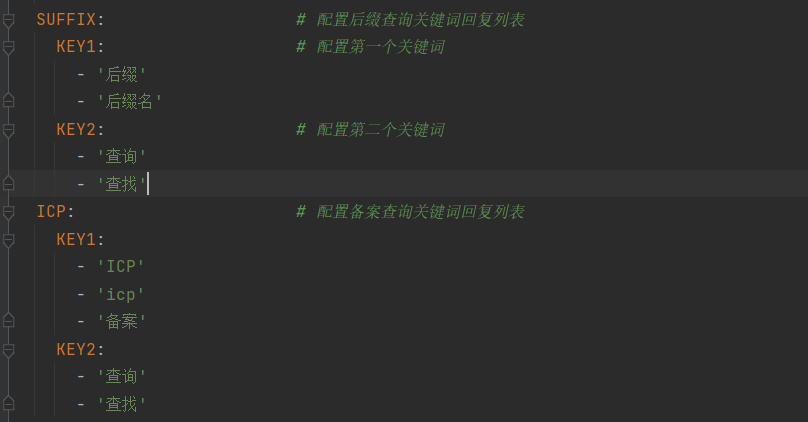
     - 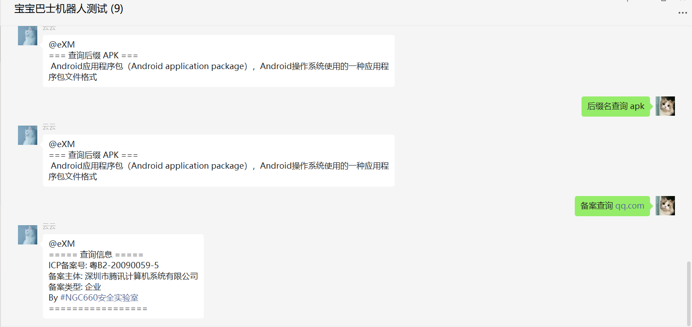

5. 自定义回复
   - 第一处地方，请写触发的关键词，第二处请写触发关键词后回复的内容
     - 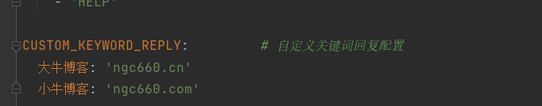
     - 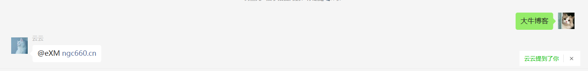
6. 积分关键词配置
   - 可自定义签到口令，签到积分，功能积分，关键词配置
     - 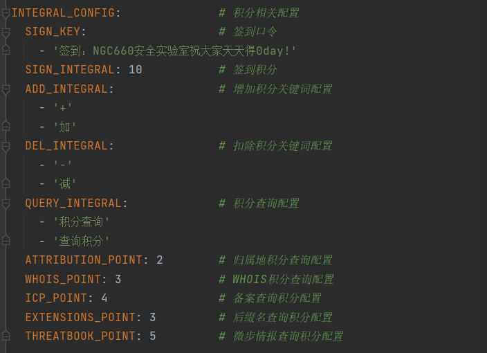
7. 系统消息配置
   - 可自定义入群欢迎消息，版权信息，下班通知【\n即为换行】
     - 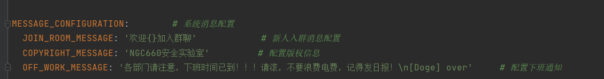

### 后续开发计划

```
- Github工具 + CVE 实时推送
- MD5解密
- ... ...
```

##### 最后，若在使用过程中有任何问题，也提交Iessus，或者关注微信公众号，后台回复消息


#### 特别鸣谢

- https://github.com/zhizhuoshuma/WechatBot
- https://github.com/tom-snow/wechat-windows-versions
