<h3 align="center">
NGCBot V2.3
</h3>


<h5 align="center">
一个基于✨HOOK机制的微信机器人，支持🌱安全新闻定时推送【FreeBuf，先知，安全客，奇安信攻防社区】，👯Kfc文案，⚡漏洞查询，⚡手机号归属地查询，⚡知识库查询，🎉星座查询，⚡天气查询，🌱摸鱼日历，⚡微步威胁情报查询，
🐛视频，⚡图片，👯帮助菜单。📫 支持积分功能，⚡支持自动拉人，，🌱自动群发，👯Ai回复，⚡视频号解析，😄自定义程度丰富，小白也可轻松上手！已支持MCP~
</h5>
<div style="text-align: center">
    <a href="http://ngc660.cn">
        
    </a>
    
  <a rel="nofollow" href="https://gitcode.com/ngc660sec/NGCBot">
    
  </a>
    
    
    
</div>


## 💫 一、项目概述

**本Bot是一款基于Hook机制的微信机器人，经过两年的更新迭代，目前功能更加面向大众，此项目会不定期维护，当然如果你有代码能力，也可以自己维护。目前支持功能(请看使用帮助)，最新支持功能：Ai(Gpt，星火，千帆，混元，月之暗面，智谱，DeepSeek，豆包)，关键词拉人进群，自动群发，入群欢迎，游戏功能。如果你有更好的想法，请进群交流。转载此项目请勿标记原创，否则后果自负！！使用此项目人员请勿做违法犯罪行为，否则后果自负！！**

**注意⚠️注意⚠️：此项目完全开源，如果你是给钱了才用上本项目的，请注意，不要被坑了**

**作者：云山/eXM**

**项目版本：NGCBot V2.3**

**官方公众号：NGC660安全实验室**

**如果你觉得此项目不错，可以给个Star或给个赞赏 关注一下公众号**

<div style="display: flex;">
  
  
</div>


## 📖 二、项目结构

```css
│  .wcf.lock																					# WCF锁文件
│  main.py																						# 启动主文件
│  README.md																					# 必须看的文件
│  requirements.txt																		# 依赖文件
│  test.py																						# 测试文件
├─ApiServer																						# API服务文件夹			
│  │  ApiMainServer.py																# API主服务文件，所有接口都要在此处注册
│  ├─AiServer																					# AI服务文件夹
│  │  │  AiDialogue.py																# AI主服务文件
│  │  │  sparkPicApi.py																# 星火AI服务文件
│  ├─gameServer																				# 游戏服务文件夹
│  │  │  idiomGame.py																	# 成语接龙游戏文件
│  │  │  __init__.py																	# 注册游戏服务文件
│  ├─pluginServer																			# API插件服务文件夹
│  │  │  HappyApi.py																	# 娱乐功能API服务文件
│  │  │  NewsApi.py																		# 新闻功能API服务文件
│  │  │  PointApi.py																	# 积分功能API服务文件
│  │  │  __init__.py																	# 注册API服务文件
├─BotServer																						# 机器人服务文件夹
│  │  MainServer.py																		# 机器人主服务文件
│  ├─BotFunction																			# 机器人功能服务文件夹
│  │  │  AdminFunction.py															# 管理员功能文件
│  │  │  AdministratorFunction.py											# 超级管理员功能文件	
│  │  │  GameFunction.py															# 游戏功能文件
│  │  │  HappyFunction.py															# 娱乐功能文件
│  │  │  InterfaceFunction.py													# 机器人消息处理接口功能文件
│  │  │  JudgeFuncion.py															# 机器人关键词判断
│  │  │  PointFunction.py															# 积分功能文件
│  │  │  RoomMsgFunction.py														# 群聊消息统计功能文件
│  ├─MsgHandleServer																	# 机器人消息处理服务文件夹
│  │  │  FriendMsgHandle.py														# 好友消息处理服务文件
│  │  │  GhMsgHandle.py																# 公众号消息处理服务文件
│  │  │  RoomMsgHandle.py															# 群聊消息处理服务文件
├─Config																							# 机器人配置文件夹
│  │  Config.yaml																			# 机器人配置文件
│  │  ConfigServer.py																	# 机器人配置服务文件
├─DbServer																						# 数据库服务文件夹
│  │  DbDomServer.py																	# 数据库操作服务文件
│  │  DbGhServer.py																		# 公众号数据库服务文件
│  │  DbInitServer.py																	# 数据库初始化服务文件
│  │  DbMainServer.py																	# 数据库主服务文件
│  │  DbPointServer.py																# 积分数据库服务文件
│  │  DbRoomMsgServer.py															# 群聊消息数据库服务文件
│  │  DbRoomServer.py																	# 群聊管理数据库服务文件
│  │  DbSignServer.py																	# 群聊积分数据库服务文件
│  │  DbUserServer.py																	# 用户管理数据库服务文件
├─FileCache																						# 缓存文件夹
│  │  FileCacheServer.py															# 缓存服务文件
├─logs																								# WCF日志文件夹
│  │  wcf.txt																					# WCF日志文件
├─OutPut																							# 消息输出文件夹
│  │  outPut.py																				# 消息输出服务文件
├─PushServer																					# 推送服务文件夹
├─WebServer																						# WebServer服务文件夹
│  │  PushMainServer.py																# 推送服务主文件
```

## ⚡️ 3、快速启动

### 3.1、Bot 快速启动

**注意：此Bot只能在Windowns系统上运行！！！无法在Linux上运行安装**

首先请克隆代码到本地，使用命令如下

```git
git clone https://github.com/ngc660sec/NGCBot.git
```

也可以直接Download

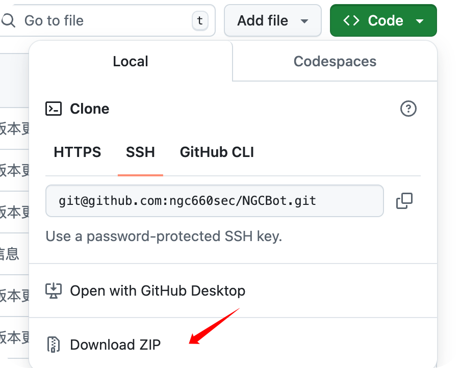

下载`Python`，使用`Python 3.8.10`版本**（Python版本不得低于3.8.10，不得高于3.13）** [点我下载](https://www.python.org/ftp/python/3.8.10/python-3.8.10-amd64.exe)

使用`pip`安装项目包（不懂就按顺序运行）

```bash
pip config set global.index-url https://mirrors.tuna.tsinghua.edu.cn/pypi/web/simple
python -m pip install --upgrade pip
pip install -r requirements.txt
```

安装完毕后你的 `WCF`版本应该是 `39.4.2.2`，请选择对应的微信进行下载

- `wcferry==39.0.12.0`：[WeChatSetup-3.9.2.23.exe](https://github.com/ngc660sec/NGCBot/releases/download/V2.0-龙年贺岁版/WeChatSetup-3.9.2.23.exe)
- `wcferry==39.2.4.0`：[WeChatSetup-3.9.10.27.exe](https://github.com/lich0821/WeChatFerry/releases/download/v39.2.4/WeChatSetup-3.9.10.27.exe)
- `wcferry==39.4.2.2`：[WeChatSetup-3.9.12.17](https://github.com/lich0821/WeChatFerry/releases/download/v39.4.2/WeChatSetup-3.9.12.17.exe)

安装完毕后，启动`main.py`文件

```
python main.py
```

出现以下界面，说明启动成功


进入微信之后，会自动初始化必备文件

## 3.2、视频教程

视频已经上传至B站，Github放不了，要看的话大家去B站看即可，此教程为快速上手+开发指南

https://www.bilibili.com/video/BV1voqwYAEWs/

### 3.3、配置文件快速配置

可以使用硅基流动，点击此链接注册：

https://cloud.siliconflow.cn/i/M3ytr9bQ

如果启动成功，下一步配置所需的`Key`，**Ai 对话**等功能都需要用到 `Key`

以下是Ai服务相关的Key配置，**注意：{} 要删除！！！**

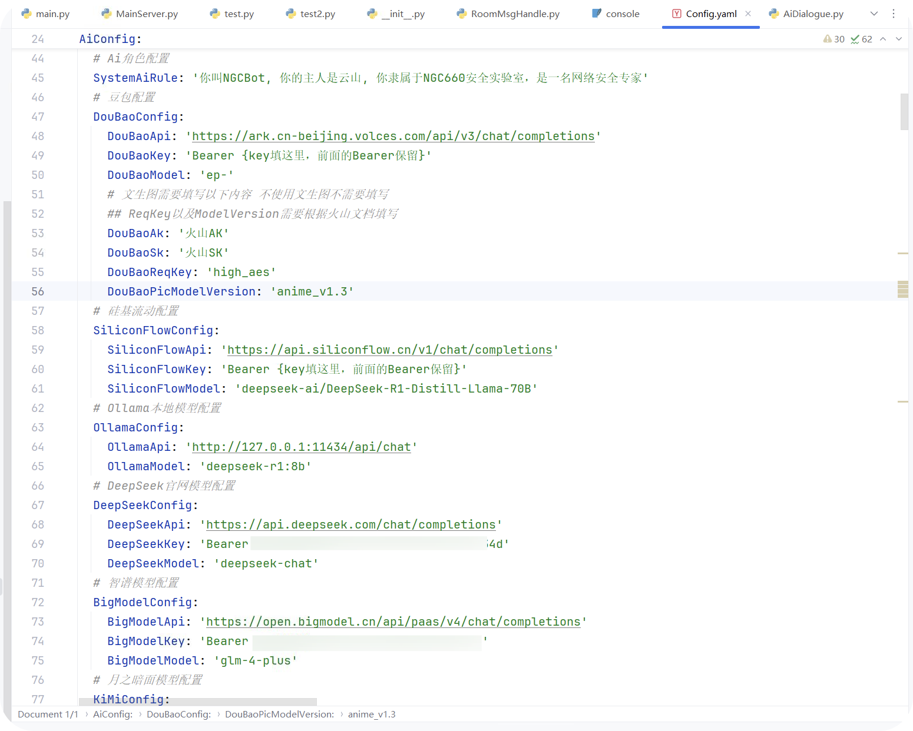

其它Key配置：

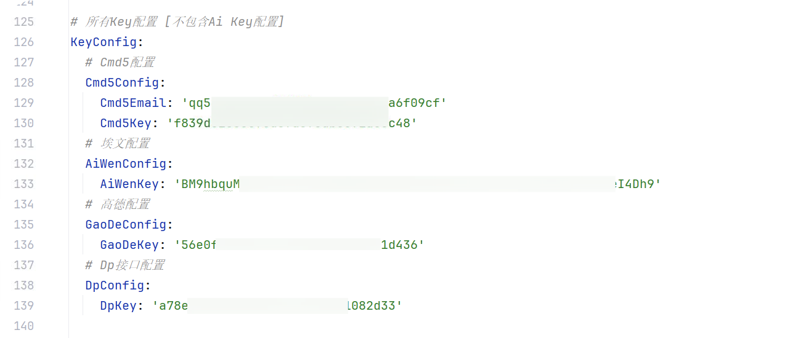

这些`Key`按需配置，如不配置则无法使用以下功能

```
1、MD5查询
3、溯源定位
4、舔狗日记
```

#### 3.3.1、各种 Key 配置

这里介绍几个比较难找的

**星火 Key 配置**

这里的模型版本采用的是`4.0Ultra`，如果要使用其它的，请自己修改此参数

进入[官网](https://xinghuo.xfyun.cn/)

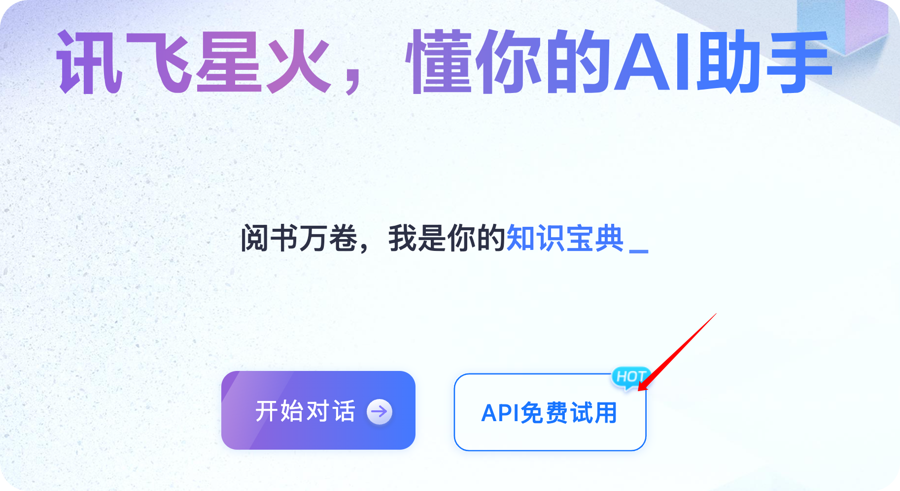

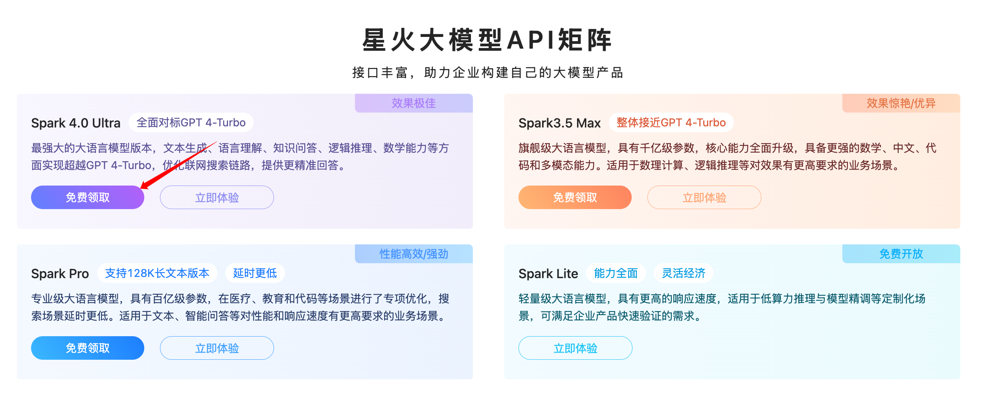

没有应用请先创建应用


在 [我的应用](https://console.xfyun.cn/app/myapp) 中，点击你新建的应用，找到`Spark4.0 Ultra`

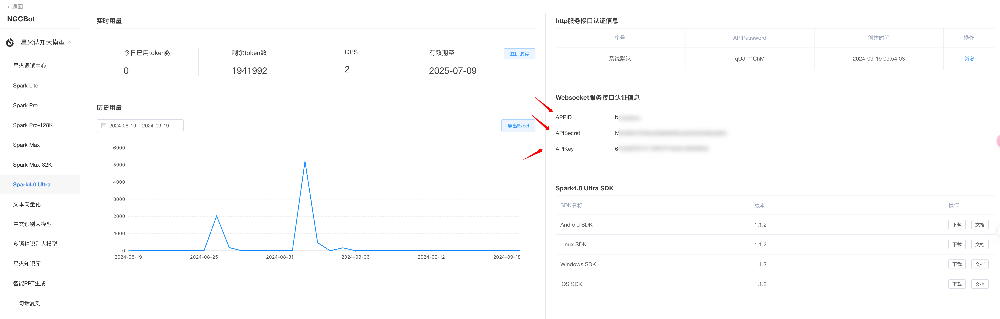

填入到配置文件中即可

**千帆 Key 配置**

进入到 [千帆官网](https://qianfan.cloud.baidu.com/) ，后台找到应用接入，点击创建应用

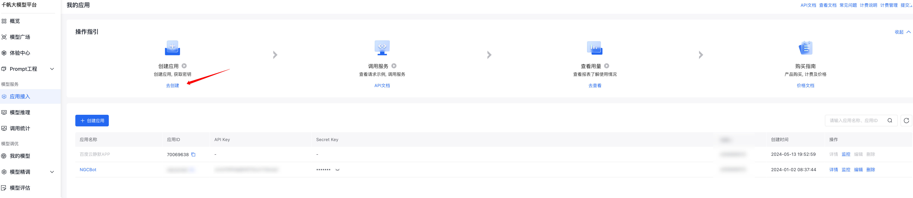

记下你的配置，填入到配置文件中即可，千帆模型没有免费额度，请充值使用！！

**Ai 作画(千帆)**

点击此 [链接](https://console.bce.baidu.com/ai/#/ai/intelligentwriting/app/detail~appId=5507940)

创建应用即可


全选即可

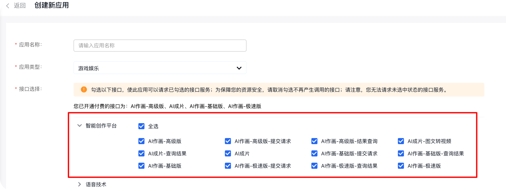

在应用列表中 找到你的应用，记下配置，填入到配置文件中，此功能也需要充值使用

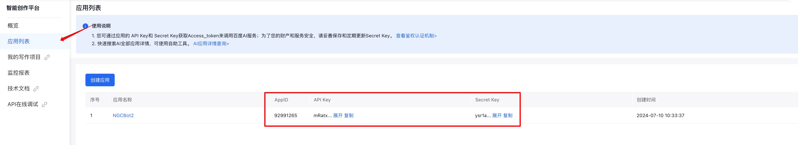

**腾讯混元配置**

这个要到腾讯控制台开通，点击[此处](https://console.cloud.tencent.com/hunyuan/start)跳转，开通后会自动赠送额度

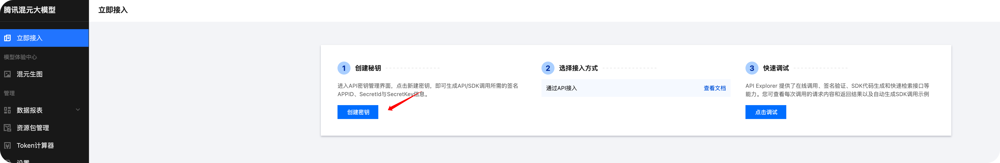

点击创建密钥

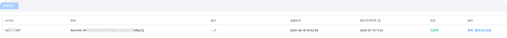

记下你所有的配置，然后填入到配置文件中即可

【2024.12.30】新增Key - DpKey


访问目标[官网](https://api.dudunas.top/)

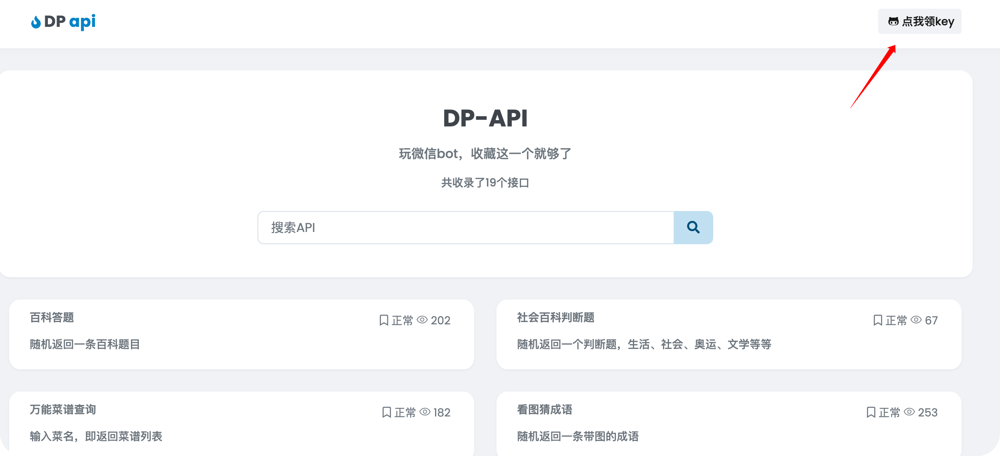

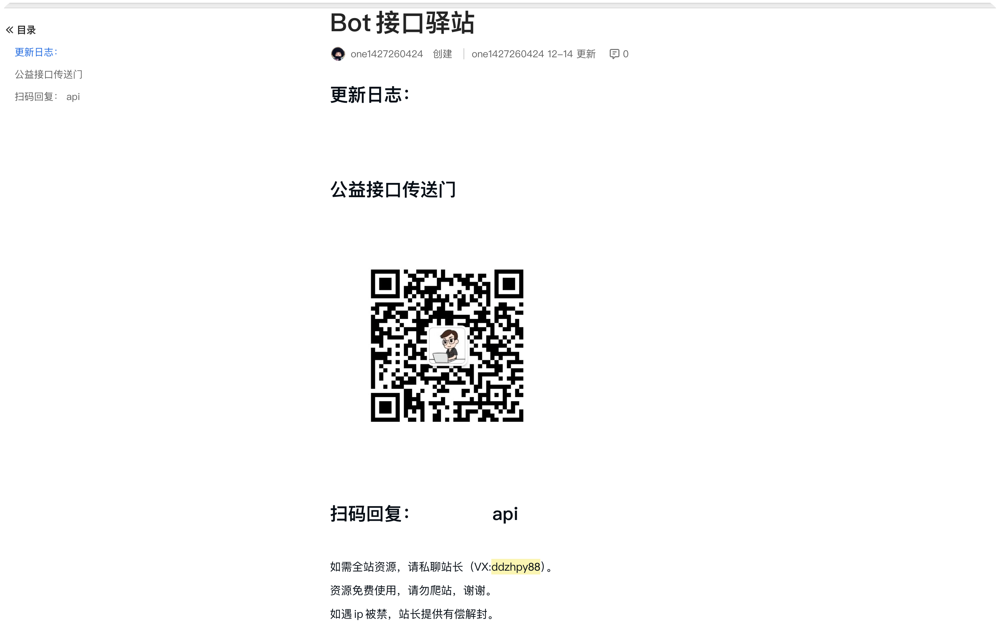

扫码添加即可

【2024.1.07】新增DeepSeek

访问目标[官网](https://www.deepseek.com/)

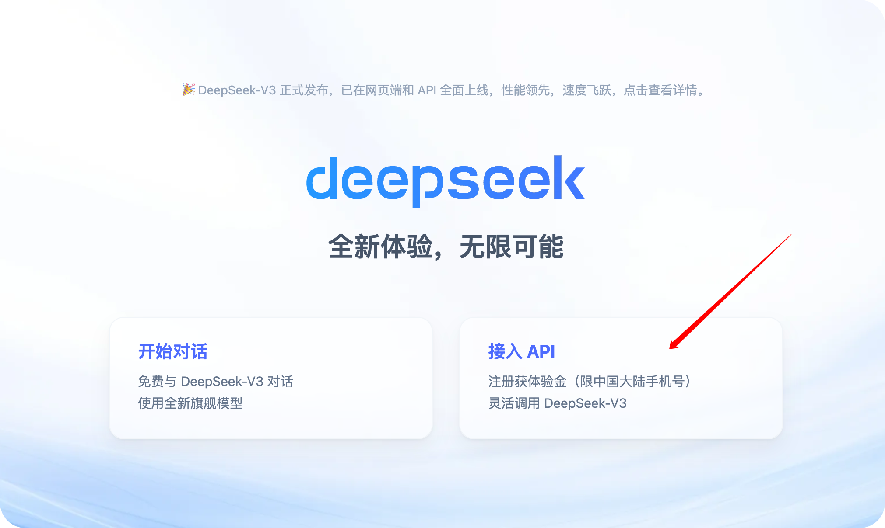


新人注册500w Token，总结群聊消息用的是此模型，可以自己在代码中切换使用模型

【2025.02.27】新增豆包模型配置

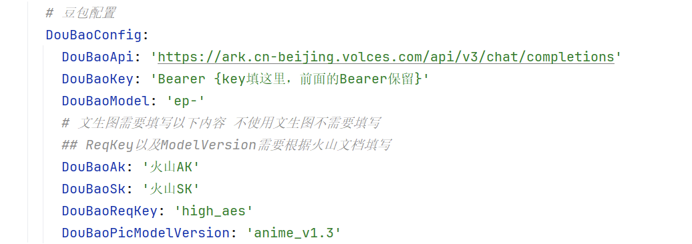

具体参数请参考火山官方文档填写！

## 🧐 4、使用帮助

### 4.1、第一次使用看这里

在运行成功后，你需要设置你的权限为超级管理员，当然你也可以设置多个超级管理员，拿到你的`wxid`即可。

给机器人发一条消息


拿到此`wxid`，放到配置文件当中即可

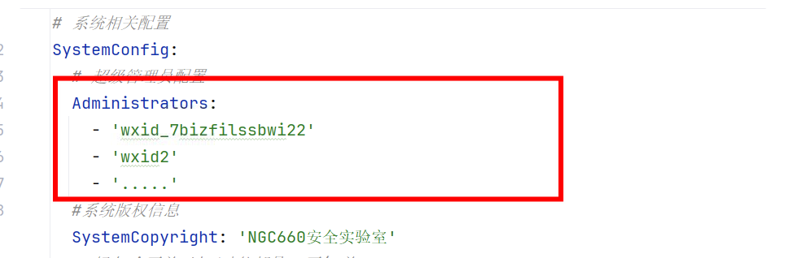

若添加多个超级管理员，请按格式添加！

### 4.2、功能介绍

#### 4.2.1、超级管理员功能（向下支持管理员功能）

1. 添加管理员
2. 删除管理员
3. 关键词进群
4. 进群欢迎
5. 好友消息自动转发给超管
6. 自动转发消息
7. 发消息给机器人好友
8. 查看白名单群聊
9. 查看黑名单群聊

**1、添加管理**


**2、删除管理**


**3、关键词进群**

需要先拿到`roomid`，再在配置文件中设置即可


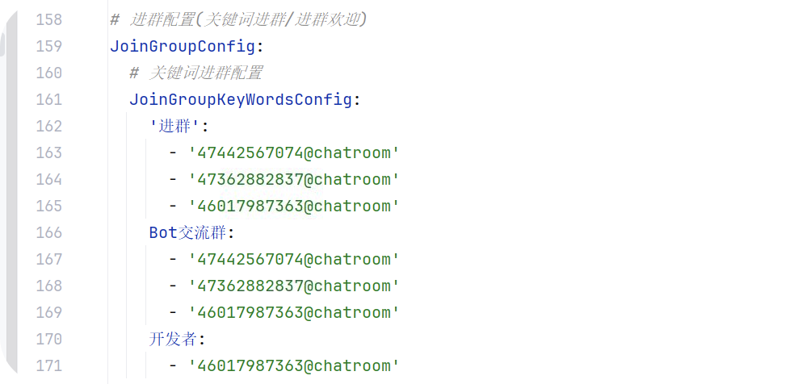

可设置多个群聊，当某个群聊人数满了之后自动邀请下一个群聊。给机器人发送进群关键词即可触发

**4、关键词回复**

在配置文件中设置即可


关键词可设置多个，回复内容只限文本。群聊或好友都可触发


**5、加好友后自动回复**
添加好友后自动回复一条消息，在配置文件中设置


**6、进群欢迎**
当有人加入群聊后，自动回复一条消息，在配置文件中设置（群聊需开启推送服务）


**卡片类进群欢迎，自定义文字类进群欢迎**

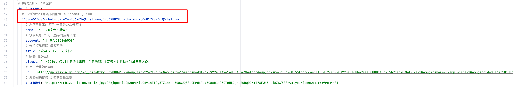

卡片类，需要先拿到卡片的各种信息，在终端中会输出

`title `字段，不能太长，其中 `{}` 代表进入群聊的好友名称 

---


自定义文字类进群欢迎，前面加群聊 ID，后面为需要发送的文字 `\n`为换行

**7、自动转发消息**

首先你需要添加几个推送群聊，才能使用此功能。添加完推送群聊后，可以愉快使用，如下！

给机器人发送公众号消息


机器人会自动推送消息到推送群聊


查看白名单群聊

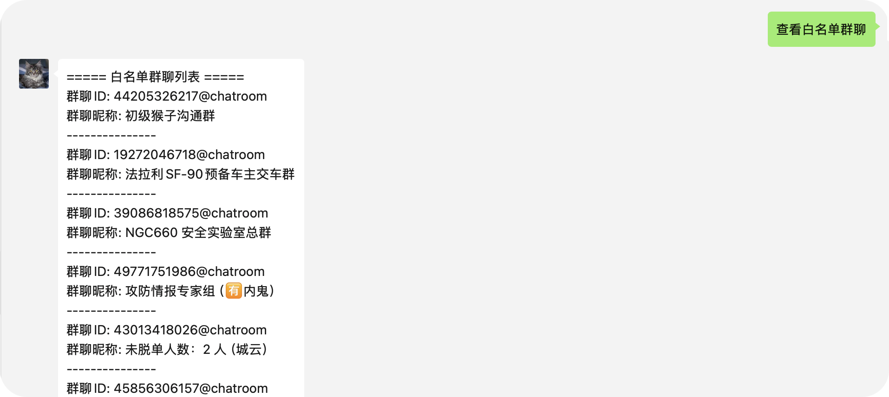

查看黑名单群聊同理

#### 4.2.2、管理员功能

**注意：管理员功能超级管理员也能用！！管理员以及超级管理员使用积分功能不消耗积分！！**

1. 开启推送服务
2. 开启白名单
3. 添加黑名单
4. 添加积分、删除积分
5. 踢人

这里不对开启或者关闭做任何介绍，使用方法也很简单，在群内发送你在配置文件里面设置的关键词即可，比如：


发送开启推送即可在此群开启推送服务，关键词可以设置多个，代表这两个关键词都可以触发这个功能


踢人功能使用也很简单，需要@罢了


**添加积分：需要@用户，可@多个用户，注意空格。使用如下【@群友1加空格[积分]】**


其它功能不做介绍。介绍一下黑名单群聊，白名单群聊，普通群聊，推送群聊的功能划分

**黑名单群聊：所有功能无法使用**

**白名单群聊：积分功能无限制**

**普通群聊：可正常使用积分功能，娱乐功能**

**推送群聊：定时推送安全新闻，等等其它推送服务，进群欢迎**

#### 4.2.3、娱乐功能

1. 图片
2. 视频
3. KFC文案
4. 舔狗日记
5. 早报
6. 晚报
7. 表情包功能
8. 短剧搜索功能
9. 视频号解析下载
10. 抖音视频解析下载
11. Help功能菜单
12. 塔罗牌游戏功能
13. 点歌功能

演示几个用法，基本都是这样用的，查询类功能注意空格⚠️

**图片功能**


出现此类问题一般是接口不稳定，或者网络不稳定，重新发送即可


**视频**


**舔狗日记**

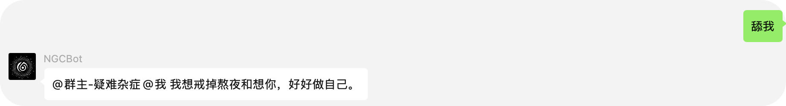

**表情包功能**

此功能需要你的 `WCF` 版本在大于等于`39.2.4.0` 才可以使用，其它版本无法使用

使用前请在终端输入以下命令否则会报错，在使用随机表情时有概率出现报错（不用管，后续修复）

```
meme download
```

使用效果如下

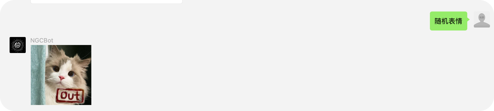

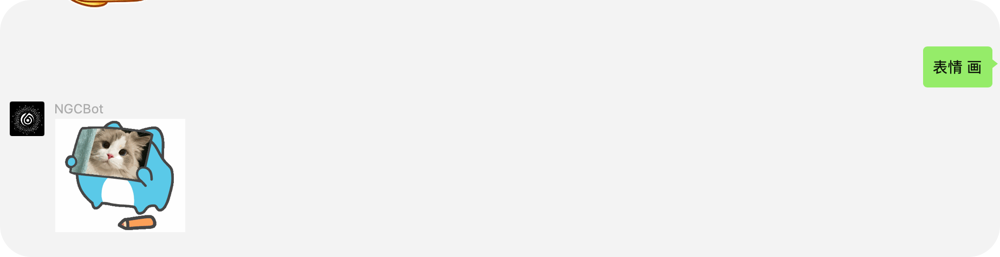

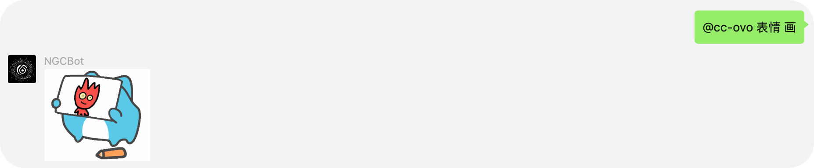

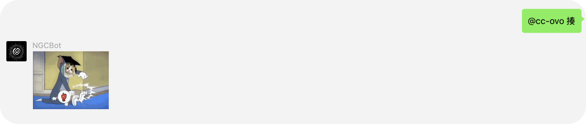

#### 4.2.4、积分功能（管理或超管不需要积分）

1. 签到（签到获得的积分可在配置文件中设置）
2. 赠送积分
3. Md5查询
5. 积分查询
6. Ai 对话
7. Ai 画图

一样的，演示几个功能（微步IP查询已删除，这里只做演示！）


**积分查询**


**画图功能**

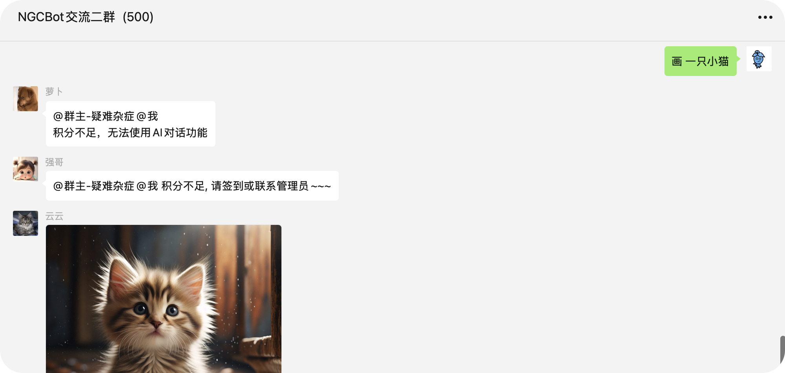

**注意：与好友对话只触发 Ai 功能和关键词回复功能**

#### 4.2.5、推送群聊功能

【推送群聊】，支持定时推送摸鱼日历，早报，晚报，入群欢迎，消息转发，下班推送。

**注意：只对推送群聊有效，如果没有添加到推送群聊请先添加！**

推送时间可在配置文件中设置

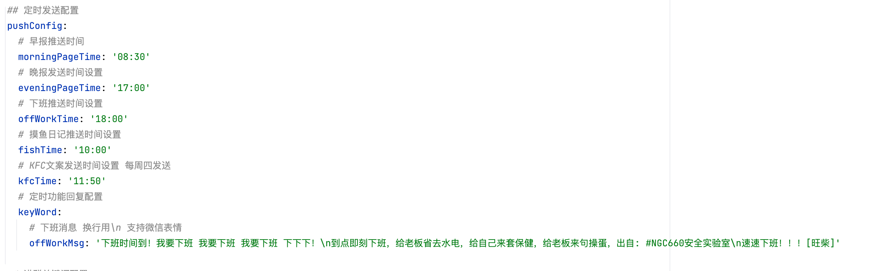

如何添加推送群聊？

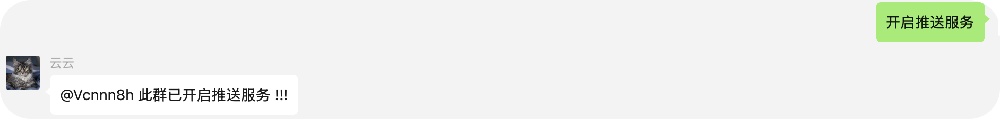

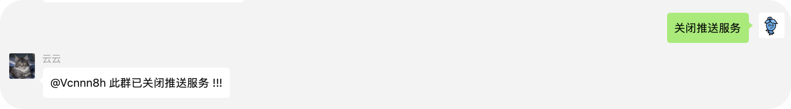

#### 4.2.6、白名单群聊功能

如何开启白名单群聊？

答：群内发送【添加白名单】即可

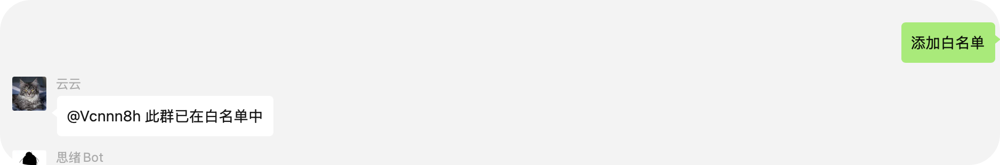

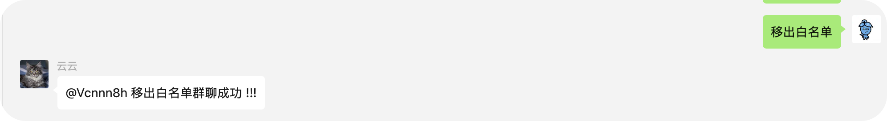

群内使用积分功能不需要积分，其它一样

**注意：白名单以及推送群聊才可以使用【群聊总结功能&撤回消息检测功能&发言排行榜&潜水榜】**

#### 4.2.7、黑名单群聊功能

如果群聊同时开启了黑名单群聊和白名单群聊，那么会触发白名单群聊的判断，不会进入到黑名单群聊。也就是说，不要同时开启！

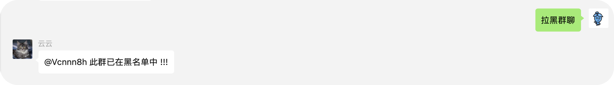

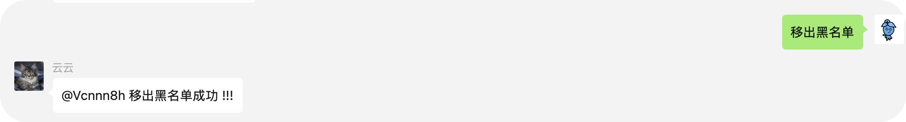

群内只能使用积分功能（管理员或者超管不限制）

### 4.3、其它配置

其它配置请查看配置文件，请自行理解，这里不做介绍

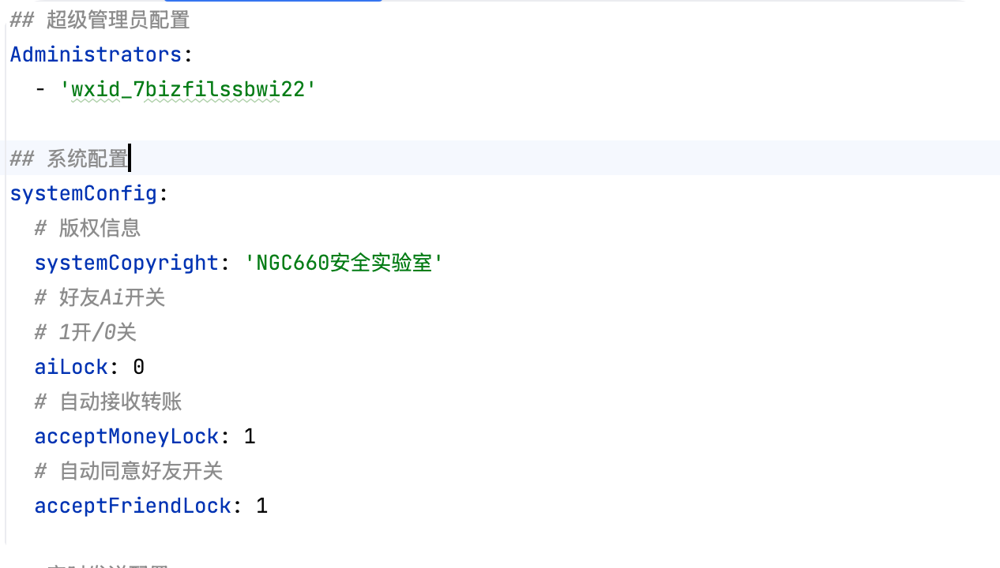


## ❓ 5、一些常见的问题

**有问题！看配置文件！看配置文件！看配置文件！有些人配置文件不配置，在这问为什么用不了？那我问问你你不拿碗不拿筷子怎么吃饭？**

其它问题，若是Bug请提供给群主即可，配置文件空着的都要自行配置，这里并不提供

```
1、启动失败问题

- 在任务管理器中关闭微信，重新打开即可
```

```
2、使用的Ai画图关键词，但是触发的是 Ai 对话功能

- 机器配置不太够，导致去除@人的名字时 没有去除成功
```

```
3、机器配置多少才够

- 按理说 4h8g 即可，主要是不要调用的太频繁
```

```
4、为什么我的表情包功能使用不了?

- 没输入下载命令，或者版本过低
```

```
5、为什么我自动通过好友失败

- wcf 版本为 39.2.4.0 时，无法使用自动通过好友功能以及自动接收转账功能
```

```
6、为什么我好友 Ai 对话没用

- Ai 对话开关没开，或者 Key 未配置
```

```
7、提示注入失败

- 检查wcf版本和微信版本是否一致
```

```
8、提示VC++14错误？

- 百度一下吧...
```


### ❌ 5.1、Bug提交处

关注微信公众号，后台留言（不做回复，请进群交流），添加机器人回复 `Bot交流群` 拉你进群！（机器人不常开，看到会拉群）

<div style="display: flex;">
  
   
</div>


### 💰 5.2、会员群聊处

**前言**：在项目更新的过程中发现许许多多的同学不会配置项目，也有许多的同学想要接入自己的API但又没学过 `Python` 。所以今天（2024,12,04）宣布建立会员交流群，主要解决以下几个问题：

1. 不会配置项目，不会启动项目
2. 接入API问题，不会接入自己的API
3. 想要实现自己的功能，比如（客服）
4. 等等... ...

进入付费群聊后会在群内进行指导必要时可提供远程协助，另外会开设特定课程如：Python基础课程，机器人使用教程（视屏），API接入课程（指南），等等(还没想好)

另外还会发布机器人+其它大模型的结合使用教程

价格暂定：（**99**）

付费时效：**终生**

联系方式：

<div style="display: flex;">
  
</div>

### ❗️  5.3、谨防诈骗

如下：

首先此项目启动不需要VPN，另外跟有没有公网IP也没有关系，只需要你电脑配置能登微信，能联网即可

<div style="display: flex;">
  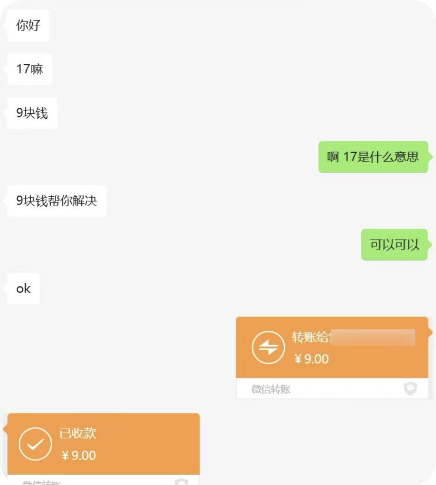
   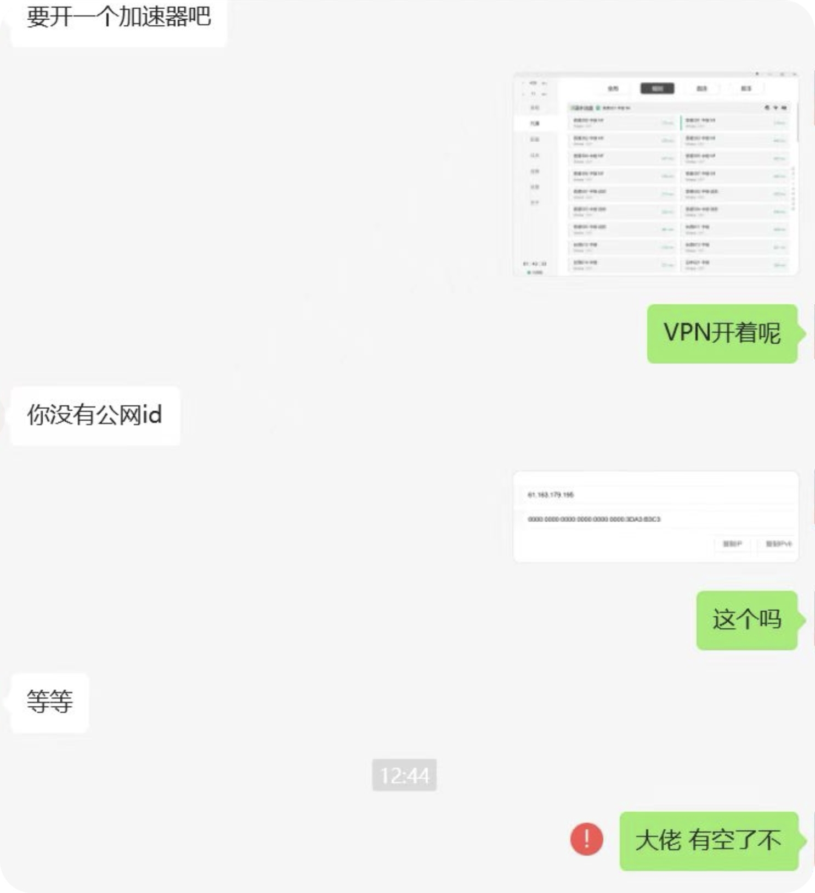
</div>


## 📝 6、更新日志

```css
- 【2022.12.8】 推送Bot 1.0版本，为初始版本
- 【2022.12.17】推送Bot 1.2版本，新增部分接口，重写部分代码，新增积分功能
- 【2023.1.1】  推送Bot 1.3版本，重写部分代码，优化代码逻辑，优化积分功能，优化定时推送功能
- 【2023.3.6】  推送Bot 1.4版本，总体代码优化，优化定时推送，优化积分功能，新增消息转发，维护API服务调用
- 【2023.3.29】 推送Bot 1.4.1版本，增加多线程处理消息，重写AI接口。可能会出现消息串群，@错人的问题，等后续优化更新
- 【2023.3.31】 推送Bot 18诞辰版，修复1.4.1版本，消息乱串问题，支持AI上下文检索，优化消息处理代码，实现功能分区分块处理,由于挂了代理之后，当调用ai对话接口时，会出现ERROR报错，这种问题是正常的，能弄到国外服务器就别用国内的
- 【2023.5.4】  推送Bot v18.1诞辰版,修复AI上下文消息过多无法回复的问题，修复天气查询小BUG
- 【2023.9.10】 推送Bot v1.5版本,优化AI回复,积分功能,代码逻辑,新增MD5解密功能
- 【2024.1.2】  推送Bot V2.0龙年贺岁版，框架重写！逻辑重构！更快！更稳！更多功能！
- 【2024.07.15】推送Bot V2.1版本 框架再次重写，逻辑再次重构，更快！更稳！删减一些不必要功能，新增Ai画图功能
- 【2024 09.10】推送Bot V2.2版本 新增飞书WIki查询，需要手动对接飞书知识库，修复一些存在的Bug，新增一些功能，请查看配置文件
- 【2024 12.30】推送Bot V2.2蛇年贺岁版 新增抖音视频解析，视频号解析，塔罗牌功能，优化一些代码，修复一些Bug
- 【2025.1.07】 推送Bot V2.2蛇年贺岁版功能更新，新增群聊消息总结，群聊发言排行榜，潜水榜，撤回消息监测，新增DeepSeek大模型
- 【2025.02.27】推送Bot V2.3版本 删除飞书Wiki查询，删除微步查询，新增豆包、硅基流动等大模型，更改框架结构，配置文件架构，新增游戏功能，方便扩展。目前支持看图猜成语功能
- 【2025.04.11】新增扣子，dify，图文对话，引用对话，好友图文对话，WebServer接口，MCP服务，语音AI回复，修复一些Bug
```

### 【2024.12.30】蛇年贺岁版

推送Bot V2.2蛇年贺岁版 新增抖音视频解析，视频号解析，塔罗牌功能，优化一些代码，修复一些Bug

抖音视频解析效果：

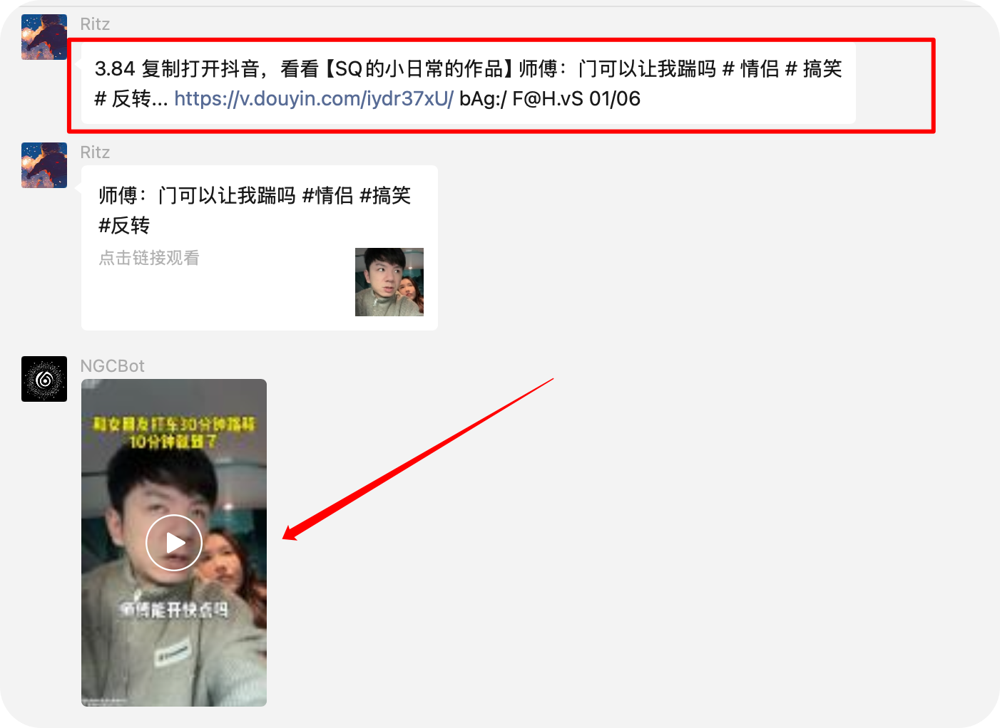

视频号解析效果，比较慢：

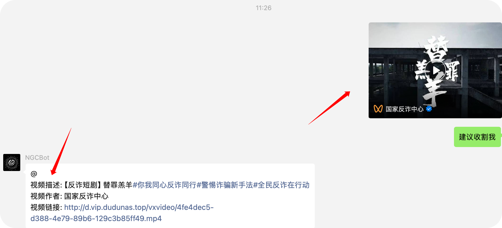

塔罗牌不演示，自己研究

### 【2025.1.07】蛇年贺岁版功能更新

新增群聊总结话题功能，群聊排行榜功能，群聊划水榜功能，撤回消息监测功能

以上功能只能在推送群聊或者白名单群聊进行使用

发言榜效果：

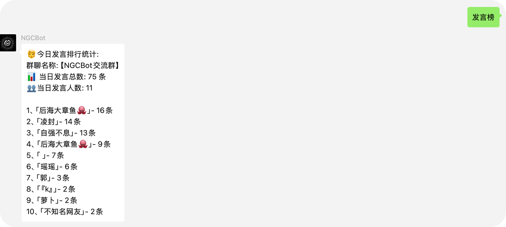

潜水榜效果：

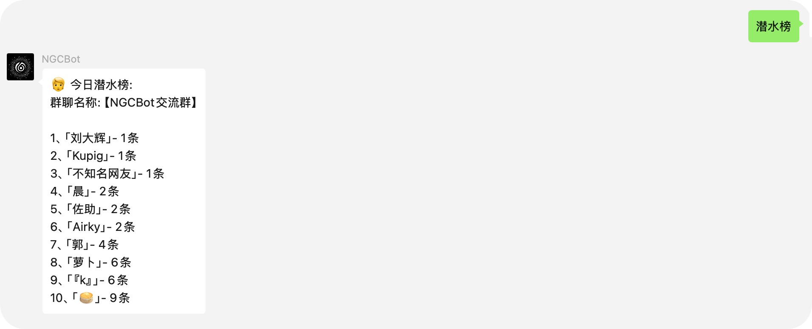

群聊消息总结效果：
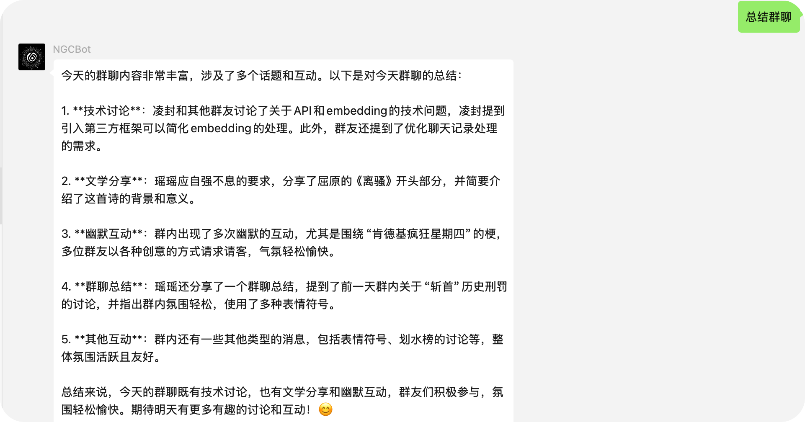

撤回消息监测效果：

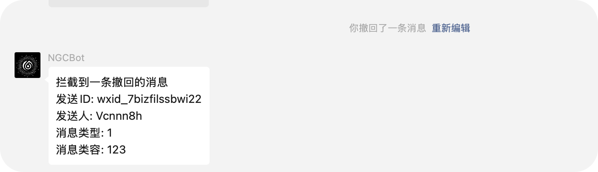

### 【2025.02.27】V2.3版本更新

新增游戏功能，看图猜成语，更新架构！

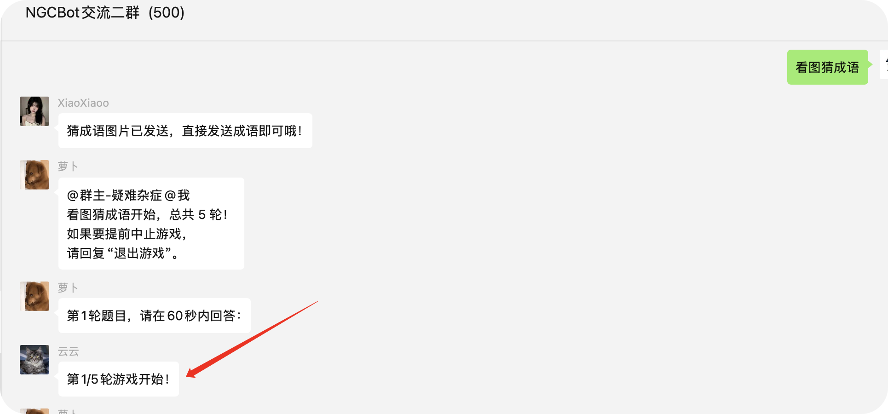

### 【2025.04.11】WebServer服务&MCP上线

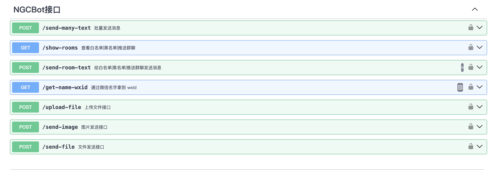

NGCBot-MCP-Server：

https://github.com/ngc660sec/NGCBot-MCP


## 🙏🏻 7、鸣谢：

https://github.com/lich0821/WeChatFerry

感谢查克大佬提供的微信Python库！！！大家可以使用此框架进行开发！

## 😘 8、支持

感谢以下团队的大力支持

- NGC660安全实验室
- CKCSec安全研究院
- 渊龙Sec安全团队

## 👈 9、感谢国产社区GitCode

如果无法访问 `Github` 也可以访问 `GitCode`

<div style="display: flex;">
  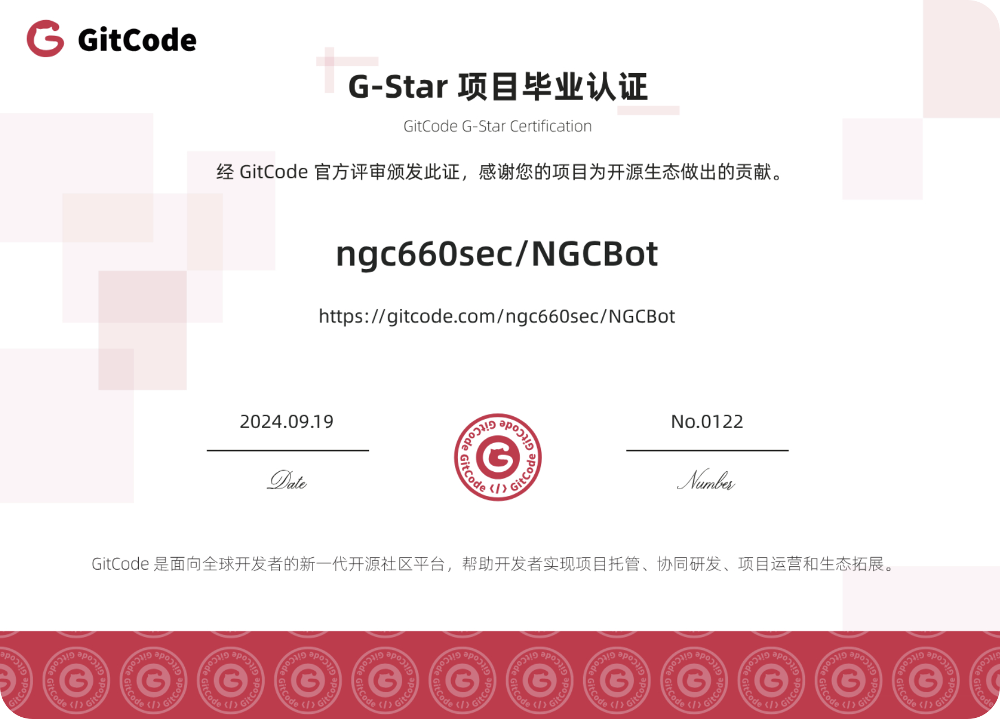
</div>


 <picture>
   <source media="(prefers-color-scheme: dark)" srcset="https://api.star-history.com/svg?repos=ngc660sec/NGCBot&type=Date&theme=dark" />
   <source media="(prefers-color-scheme: light)" srcset="https://api.star-history.com/svg?repos=ngc660sec/NGCBot&type=Date" />
   
 </picture>
