<h1 align="center">
NGCBot V2.1
</h1>


<h4 align="center">
一个基于✨HOOK机制的微信机器人，支持🌱安全新闻定时推送【FreeBuf，先知，安全客，奇安信攻防社区】，👯Kfc文案，⚡备案查询，⚡手机号归属地查询，⚡WHOIS信息查询，🎉星座查询，⚡天气查询，🌱摸鱼日历，⚡微步威胁情报查询，
🐛美女视频，⚡美女图片，👯帮助菜单。📫 支持积分功能，⚡支持自动拉人，🌱自动群发，👯Ai回复，⚡Ai画图，😄自定义程度丰富，小白也可轻松上手！
</h4>
<div style="text-align: center">
    <a href="http://ngc660.cn">
        
    </a>
    <a href="http://jiuansec.com">
    	
    </a>
    
    
    
    
</div>


## 💌一、项目概述

**本Bot是一款基于Hook机制的微信机器人，经过一年的更新迭代，目前功能更加面向大众，此项目会不定期维护，当然如果你有代码能力，也可以自己维护。目前支持功能(请看使用帮助)，最新支持功能：Ai(Gpt，星火，千帆)，关键词拉人进群，自动群发，入群欢迎。如果你有更好的想法，请进群交流。转载此项目请勿标记原创，否则后果自负！！使用此项目人员请勿做违法犯罪行为，否则后果自负！！**

**出现微信版本过低不能登陆如何解决？点击此处：https://mp.weixin.qq.com/s/g9AjM3A04sAylP-Q-17fAg**

**💞特别感谢CKCSec安全研究院的赞助支持以及各大群友的支持， 你们的支持就是我的动力😎**

#### 注意⚠️注意⚠️：此项目完全开源，如果你是给钱了才用上本项目的，请注意，你就是那个傻逼

#### 作者：云山/eXM

#### 项目版本：NGCBot V2.1

#### 官方公众号：NGC660安全实验室

#### 如果你觉得此项目不错，可以给个Star或给个赞赏 关注一下公众号

<div style="display: flex;">
  
  
</div>


## 二、项目结构

```css
│  main.py													# 入口文件
│  README.md												# Readme文件
│  requirements.txt											# 环境依赖包
├─ApiServer													# 接口服务文件夹
│  │  ApiMainServer.py										# 所有接口主服务模块
│  ├─AiServer												# Ai接口服务文件夹
│  │  │  AiDialogue.py										# Ai接口调用主服务
│  │  │  sparkPicApi.py										# 星火图像生成接口模块
│  ├─pluginServer											# 插件接口服务文件夹
│  │  │  HappyApi.py										# 娱乐功能接口模块
│  │  │  NewsApi.py											# 新闻接口模块
│  │  │  PointApi.py										# 积分接口模块
│  │  │  __init__.py										# 功能接口初始化模块
├─BotServer													# Bot服务文件夹
│  │  MainServer.py											# Bot启动主服务模块
│  ├─BotFunction											# Bot所有功能文件夹
│  │  │  AdminFunction.py									# 管理员功能模块
│  │  │  AdministratorFunction.py							# 超管功能模块
│  │  │  HappyFunction.py									# 娱乐功能模块
│  │  │  InterfaceFunction.py								# 消息处理接口
│  │  │  JudgeFuncion.py									# 关键词判断模块
│  │  │  PointFunction.py									# 积分功能模块
│  ├─MsgHandleServer										# 消息处理文件夹
│  │  │  FriendMsgHandle.py									# 好友消息处理模块
│  │  │  GhMsgHandle.py										# 公众号消息处理模块
│  │  │  RoomMsgHandle.py									# 群聊消息处理模块
├─Config													# 配置文件服务文件夹
│  │  Config.yaml											# 配置文件
│  │  ConfigServer.py										# 配置文件服务模块
│  │  Gh.db													# 公众号数据库
│  │  Point.db												# 积分数据库
│  │  Room.db												# 群聊数据库
│  │  User.db												# 用户数据库
├─DbServer													# 数据库服务文件夹
│  │  DbDomServer.py										# 数据库操作模块
│  │  DbGhServer.py											# 公众号数据库模块(暂未使用)
│  │  DbInitServer.py										# 数据库初始化模块
│  │  DbMainServer.py										# 数据库主服务模块
│  │  DbPointServer.py										# 积分操作模块
│  │  DbRoomServer.py										# 群聊数据库操作模块
│  │  DbSignServer.py										# 签到服务模块
│  │  DbUserServer.py										# 用户数据库操作模块
├─FileCache													# 缓存文件服务文件夹
│  │  FileCacheServer.py									# 文件服务模块
│  ├─aiPicCacheFolder										# Ai生图缓存文件夹
│  ├─FishCacheFolder										# 摸鱼日记缓存文件夹
│  ├─gaodeCacheFolder										# 高德地图缓存文件夹
│  ├─picCacheFolder											# 美女图片缓存文件夹
│  ├─videoCacheFolder										# 美女视频缓存文件夹
├─logs														# wcf日志文件夹
│      wcf.txt												# wcf日志
├─NGCBot.assets												# README静态资源文件
├─OutPut													# 日志输出模块文件夹
│  │  outPut.py												# 日志输出模块
├─PushServer												# 定时推送服务文件夹
│  │  PushMainServer.py										# 定时推送服务
└─README.assets												# README静态资源文件
```

## 三、快速启动

**注意：此Bot只能在Windowns系统上运行！！！无法在Linux上运行安装**

首先请克隆代码到本地，使用命令如下

```git
git clone git@github.com:ngc660sec/NGCBot.git
```

也可以直接Download


下载我提供的微信版本，注意不能更新微信⚠️

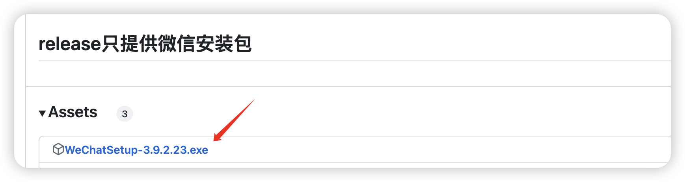

使用`pip`安装项目包

```bash
pip install -r .\requirements.txt
```

若安装缓慢，则自行换源

安装完毕后，启动`main.py`文件


若出现此问题，请使用任务管理器关闭微信重启运行此文件


进入微信之后，会自动初始化必备文件


到此，恭喜🎉，项目启动成功！使用帮助请看使用帮助章节！

## 四、使用帮助

### 4.1、第一次使用看这里🤌

在运行成功后，你需要设置你的权限为超级管理员，当然你也可以设置多个超级管理员，拿到你的`wxid`即可。

给机器人发一条消息

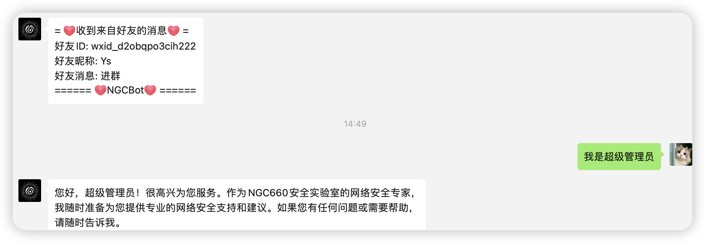

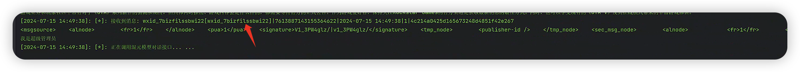

拿到此`wxid`，放到配置文件当中即可

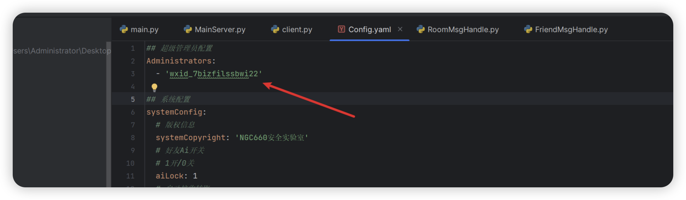

若添加多个超级管理员，请按格式添加！

### 4.2、功能介绍

#### 4.2.1、超级管理员功能

1. 添加管理员
2. 删除管理员
3. 关键词进群（配置文件中设置）
4. 关键词回复（配置文件中设置）
5. 加好友后自动回复（配置文件中设置）
6. 进群欢迎（配置文件中设置）
7. 自动转发公众号消息到推送群聊
8. 自动同意好友（不需要配置）
9. 查看白名单群聊
10. 查看黑名单群聊
11. 查看推送群聊

**1、添加管理**

```
添加管理@你要添加的人
```


或者添加多个管理

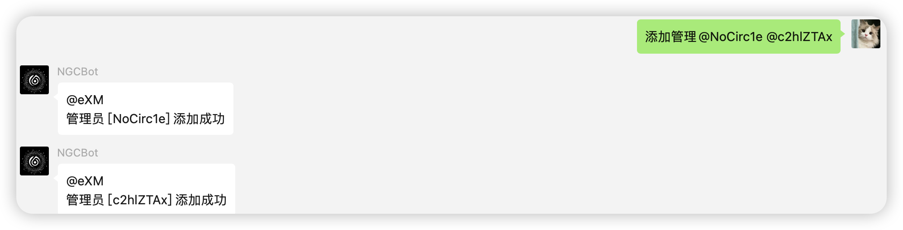

**2、删除管理**

```
删除管理@你要删除的人
```

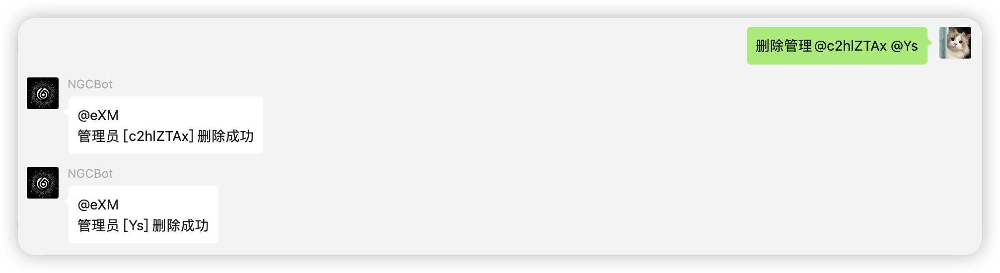

**3、关键词进群**

需要先拿到`roomid`，再在配置文件中设置即可

在你要拉进去的群里面发条消息

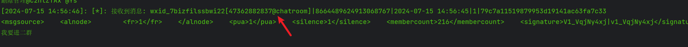

放到配置文件里面

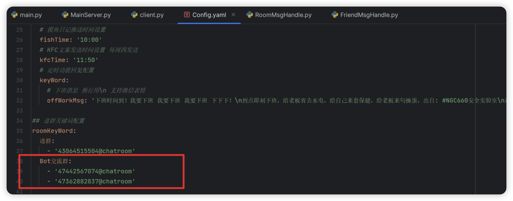

可设置多个群聊，当某个群聊人数满了之后自动邀请下一个群聊。给机器人发送进群关键词即可触发

**4、关键词回复**

在配置文件中设置即可

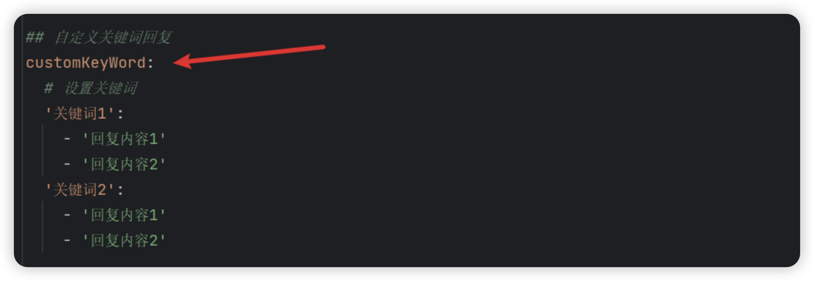

关键词可设置多个，回复内容只限文本。只有好友可以触发

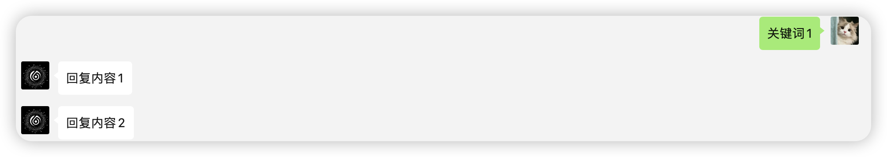

**5、加好友后自动回复**
添加好友后自动回复一条消息，在配置文件中设置

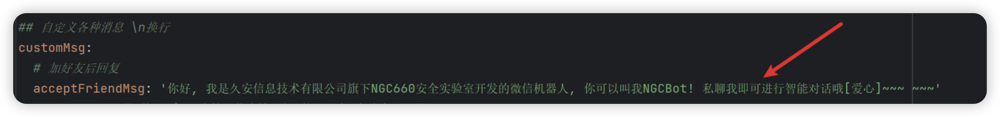

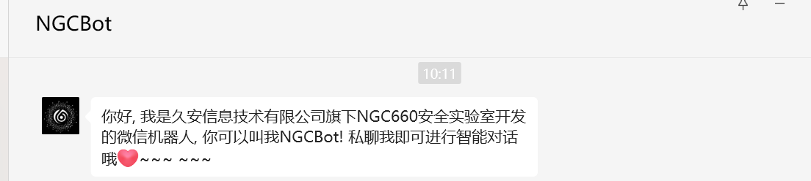

**6、进群欢迎**
当有人加入群聊后，自动回复一条消息，在配置文件中设置 只在推送群聊中有效

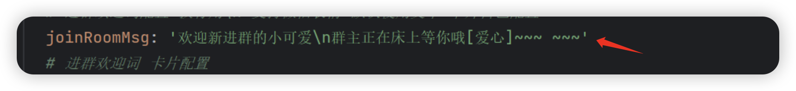

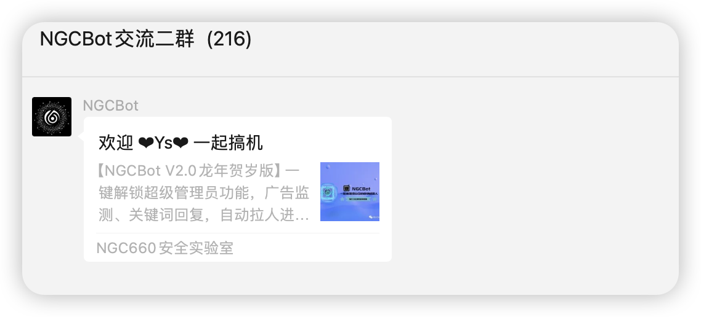

可单独设置卡片消息，上面的效果是单独设置的卡片消息

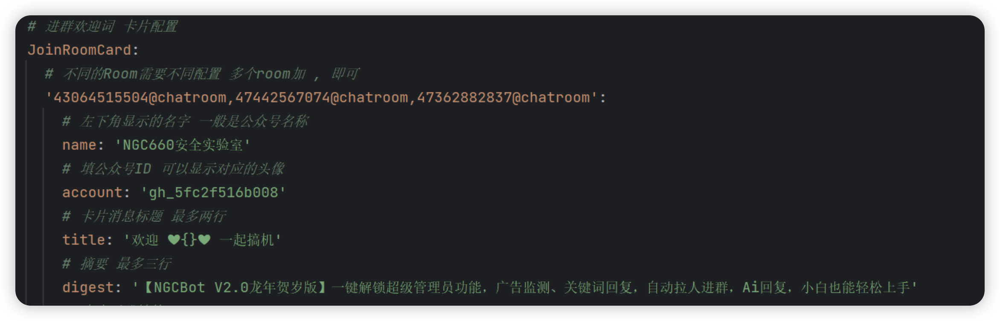

**7、自动转发消息**

首先你需要添加几个推送群聊，才能使用此功能。添加完推送群聊后，可以愉快使用，如下！

给机器人发送公众号消息


机器人会自动推送消息到推送群聊

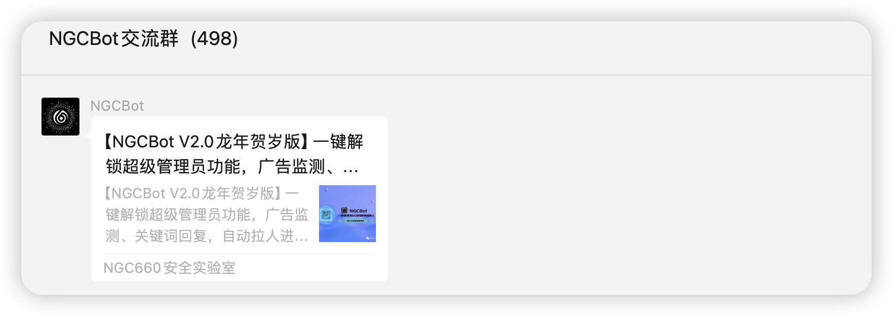

#### 4.2.2、管理员功能

**注意：管理员功能超级管理员也能用！！管理员以及超级管理员使用积分功能不消耗积分！！**

1. 开启推送服务
2. 开启白名单
3. 添加黑名单
4. 添加积分、删除积分
5. 踢人
6. 除超管之外的任何功能

这里不对开启或者关闭做任何介绍，使用方法也很简单，在群内发送你在配置文件里面设置的关键词即可，比如：

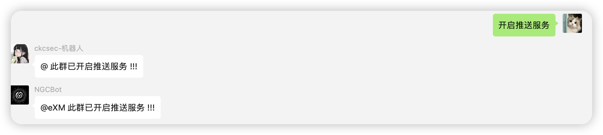

发送开启推送即可在此群开启推送服务，关键词可以设置多个，代表这两个关键词都可以触发这个功能

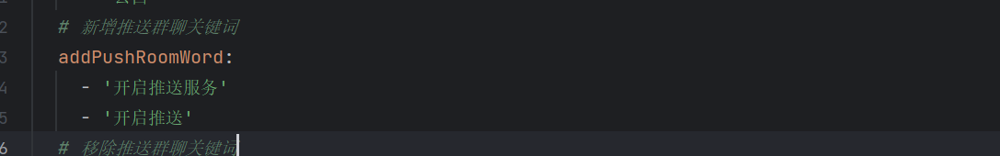

踢人功能使用也很简单，需要@罢了，可以@多个人

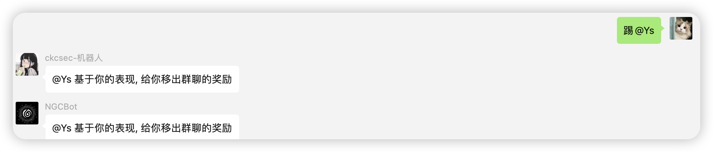

**添加积分：需要@用户，可@多个用户，注意空格。使用如下【@群友1加空格[积分]】**

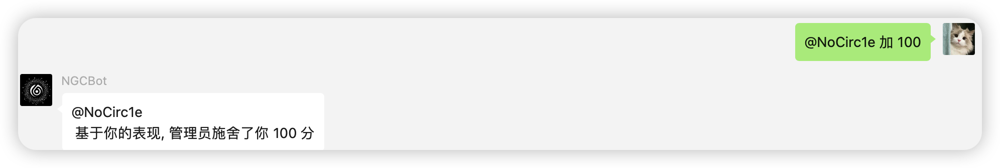

其它功能不做介绍。介绍一下黑名单群聊，白名单群聊，普通群聊，推送群聊的功能划分

**黑名单群聊：所有功能无法使用**

**白名单群聊：积分功能无限制**

**普通群聊：可正常使用积分功能，娱乐功能**

**推送群聊：定时推送安全新闻，等等其它推送服务**（具体查看配置文件）

#### 4.2.3、娱乐功能

1. 美女图片
2. 美女视频
7. KFC文案
10. 舔狗日记
13. 早报
14. 晚报
15. Help功能菜单

演示几个用法，基本都是这样用的，查询类功能注意空格⚠️

**图片功能**


如果发现不显示图片，此类问题一般是接口不稳定，或者网络不稳定，重新发送即可

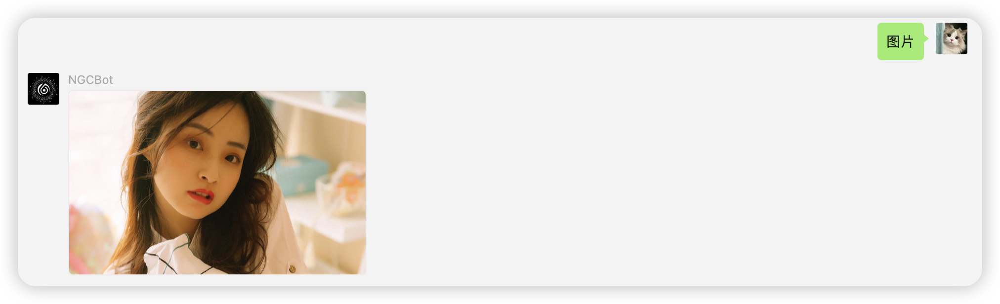

**视频**

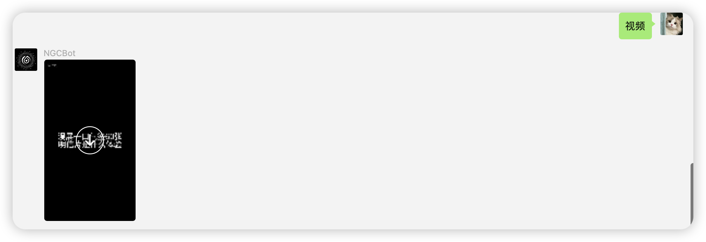

**舔狗日记**

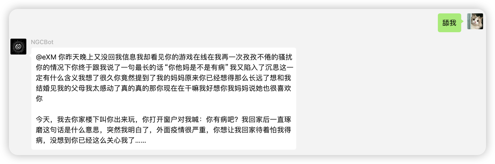

**其它功能类似**

#### 4.2.4、积分功能（管理或超管不需要积分）

1. 签到（签到获得的积分可在配置文件中设置）
2. Md5查询
3. 微步IP查询
4. 端口查询
5. 积分查询
6. Ai对话
7. Ai画图

一样的，演示几个功能

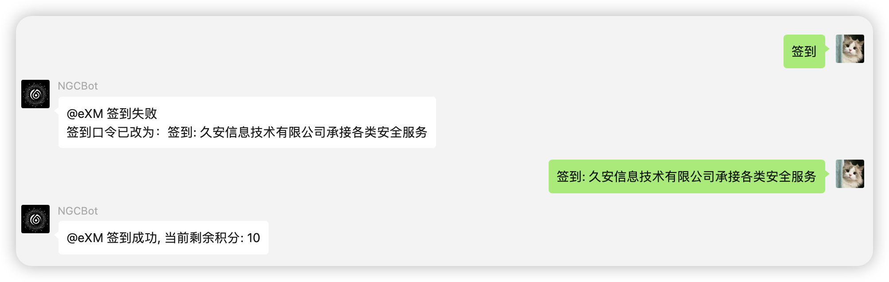

**积分查询**

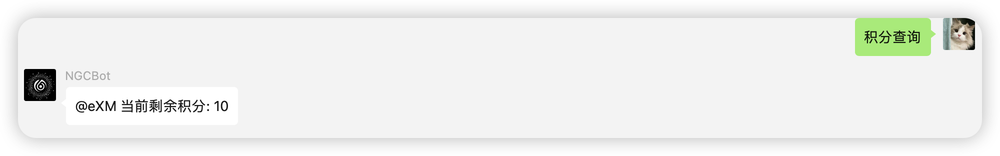

**AI对话**

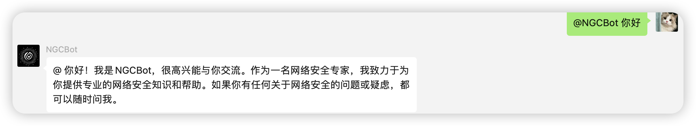

**Ai画图**

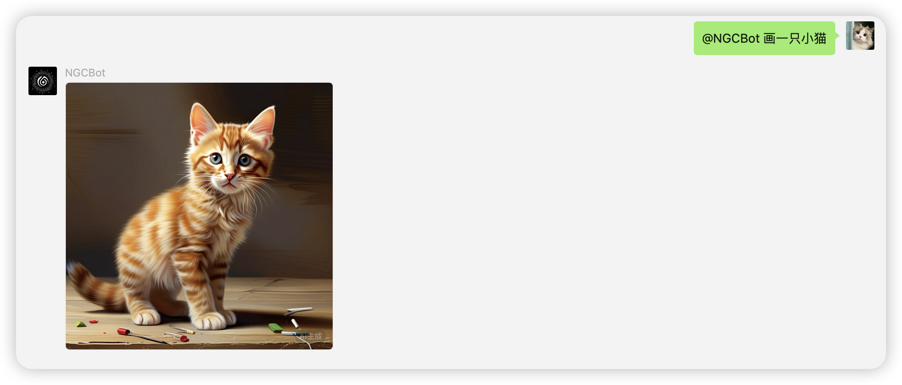

**更多功能请查看配置文件**

## 五、微信版本选择

兼容老版本微信，也就是用`NGCBotV2.0 龙年贺岁版`此版本的兄弟，但是不要更新软件包

**如果3.9.2.23版本的微信用不了怎么办？**

选择更新软件包，或查看`提示微信版本过低`的解决方法

## 5.1、如何更新

```
pip install --upgrade wcferry
```

### 5.2、wcferry==39.0.12.0 用什么版本的微信？

[WeChatSetup-3.9.2.23.exe](https://github.com/ngc660sec/NGCBot/releases/download/V2.0-龙年贺岁版/WeChatSetup-3.9.2.23.exe)

### 5.3、wcferry==39.2.4.0 用什么版本的微信

[WeChatSetup-3.9.10.27.exe](https://github.com/lich0821/WeChatFerry/releases/download/v39.2.4/WeChatSetup-3.9.10.27.exe)

此版本目前(2024.07.15)存在一些问题

- 自动接收转账无法使用

## 六、一些常见的问题

**有问题！看配置文件！看配置文件！看配置文件！有些人配置文件不配置，在这问为什么用不了？那我问问你你不拿碗不拿筷子怎么吃饭？**

其它问题，若是Bug请提供给群主即可，配置文件空着的都要自行配置，这里并不提供！

**若需要定制开发，请进群联系群主**！！！！

### 6.1、Bug提交处

关注微信公众号，后台留言，或者添加机器人回复`Bot交流群`拉你进群！

**公众号：**


**机器人微信：**


### 6.2、开发者交流群

若二维码过期或者群满`200`人，请添加机器人好友回复 `开发者` 进开发者交流群


## 七、更新日志

```css
- 【2022.12.8】 推送Bot 1.0版本，为初始版本
- 【2022.12.17】推送Bot 1.2版本，新增部分接口，重写部分代码，新增积分功能
- 【2023.1.1】  推送Bot 1.3版本，重写部分代码，优化代码逻辑，优化积分功能，优化定时推送功能
- 【2023.3.6】  推送Bot 1.4版本，总体代码优化，优化定时推送，优化积分功能，新增消息转发，维护API服务调用
- 【2023.3.29】 推送Bot 1.4.1版本，增加多线程处理消息，重写AI接口。可能会出现消息串群，@错人的问题，等后续优化更新
- 【2023.3.31】 推送Bot 18诞辰版，修复1.4.1版本，消息乱串问题，支持AI上下文检索，优化消息处理代码，实现功能分区分块处理,由于挂了代理之后，当调用ai对话接口时，会出现ERROR报错，这种问题是正常的，能弄到国外服务器就别用国内的
- 【2023.5.4】  推送Bot v18.1诞辰版,修复AI上下文消息过多无法回复的问题，修复天气查询小BUG
- 【2023.9.10】 推送Bot v1.5版本,优化AI回复,积分功能,代码逻辑,新增MD5解密功能
- 【2024.01.2】	推送Bot V2.0龙年贺岁版，框架重写！逻辑重构！更快！更稳！更多功能！
- 【2024.07.15】推送Bot V2.1版本 框架再次重写，逻辑再次重构，更快！更稳！删减一些不必要功能，新增Ai画图功能
```


## 八、鸣谢：

https://github.com/lich0821/WeChatFerry

感谢查克大佬提供的微信Python库！！！大家可以使用此框架进行开发！

## 九、支持

感谢以下团队的大力支持

- NGC660安全实验室
- CKCSec安全研究院
- 渊龙Sec安全团队

